# X4: Foundations Save/Load System

Reverse-engineered documentation of the X4 savegame architecture, file format, load/save
pipelines, and threading model. Based on IDA Pro analysis of X4 v9.00 (build 602526) and
examination of real savegame files.

---

## Table of Contents

1. [Savegame File Format](#savegame-file-format)
2. [XML Document Structure](#xml-document-structure)
3. [Load Pipeline](#load-pipeline)
4. [Save Pipeline](#save-pipeline)
5. [Threading Model](#threading-model)
6. [Key Classes and Functions](#key-classes-and-functions)
7. [Performance Characteristics](#performance-characteristics)
8. [Appendix: SaveXML Node System](#appendix-savexml-node-system)

---

## Savegame File Format

### File Location

```
<UserProfile>\Documents\Egosoft\X4\<SteamID>\save\
```

Example: `C:\Users\<user>\Documents\Egosoft\X4\138405187\save\`

### Naming Convention

| Pattern | Description |
|---------|-------------|
| `save_NNN.xml.gz` | Manual save slots |
| `autosave_NN.xml.gz` | Autosave rotation (typically 01-03) |
| `quicksave.xml.gz` | Quick save (F5) |
| `temp_save*.xml.gz` | Temporary files during write (atomic save) |

### Compression

Savegames are **gzip-compressed XML** (`.xml.gz`). Controlled by the `compresssaves` config
option:

- **Compressed** (default): `.xml.gz` -- gzip with standard headers (magic bytes `0x1F 0x8B`)
- **Uncompressed**: `.xml` -- raw XML (enabled via `nocompress` or `SetSavesCompressedOption`)

Typical compression ratios observed:

| Save | Compressed | Uncompressed | Ratio | Lines |
|------|-----------|-------------|-------|-------|
| save_006 (early game) | 29 MB | 329 MB | 11.3:1 | 8.4M |
| save_001 (late game) | 93 MB | ~1.0 GB | ~10.7:1 | ~25M+ |

### File Integrity

Each savegame ends with a `<signature>` element containing a **Base64-encoded RSA signature**
covering the XML content. Used for anti-cheat / modified-game detection:

```xml
<signature>zSePUlbCS4xj0Ryf...iceaw0Q==</signature>
```

If verification fails, the game is flagged as "modified":
- `"Savegame signature verification failed!"`
- `"MODIFIED: At some point, the game was loaded from a save with unverified signature"`

---

## XML Document Structure

### Top-Level Schema

```xml
<?xml version="1.0" encoding="UTF-8"?>
<savegame>
  <info>...</info>              <!-- Save metadata -->
  <universe>                     <!-- All game state -->
    <factions>...</factions>     <!-- Faction relations, diplomacy, licences -->
    <god/>                       <!-- God/economy engine state -->
    <component class="galaxy">   <!-- Spatial hierarchy: galaxy > clusters > sectors > zones -->
      ...
    </component>
    <aidirector>...</aidirector> <!-- AI script state for all entities -->
    <operations/>                <!-- Operations state -->
    <fleetmanager>...</fleetmanager>
    <ventures>...</ventures>     <!-- Online ventures data (XML-in-XML escaped) -->
    <notifications/>
    <ui>...</ui>                 <!-- UI state, menu filters, help hints -->
  </universe>
  <signature>...</signature>     <!-- RSA signature -->
</savegame>
```

### Info Section

```xml
<info>
  <save name="#006" date="1774625108"/>         <!-- Unix timestamp -->
  <game id="X4" version="900" build="602526"
        modified="1" time="358.408"              <!-- Game time in seconds -->
        code="131281" original="900"
        start="custom_creative"
        seed="2532348735"
        guid="3BC9D740-842D-..."/>
  <player name="Val Selton"
          location="{20004,10011}"               <!-- Zone/sector IDs -->
          money="655556000"/>
  <patches>
    <patch extension="ego_dlc_split" version="900" name="Split Vendetta"/>
    <!-- All active extensions at save time -->
    <history>
      <!-- Extensions active during the game's lifetime -->
    </history>
  </patches>
</info>
```

Used during load for:
- **Version compatibility** checks
- **Extension dependency** validation (warns if required extensions are missing/wrong version)
- **Modified game** state tracking
- **Save list** display in the UI (without parsing the full file)

### Spatial Hierarchy (Component Tree)

The galaxy is a nested component tree mirroring the game's entity-component architecture:

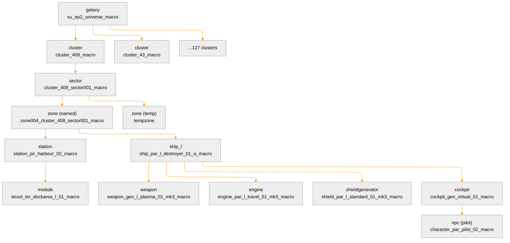

### Entity Counts (Example: save_006, Early Game)

| Entity Type | Count |
|-------------|-------|
| Clusters | 127 |
| Sectors | 152 |
| Zones | 2,301 |
| Ships | 10,594 |
| Stations | 1,394 |
| NPCs | 12,314 |
| **Total XML lines** | **8,371,066** |

### Section Size Distribution

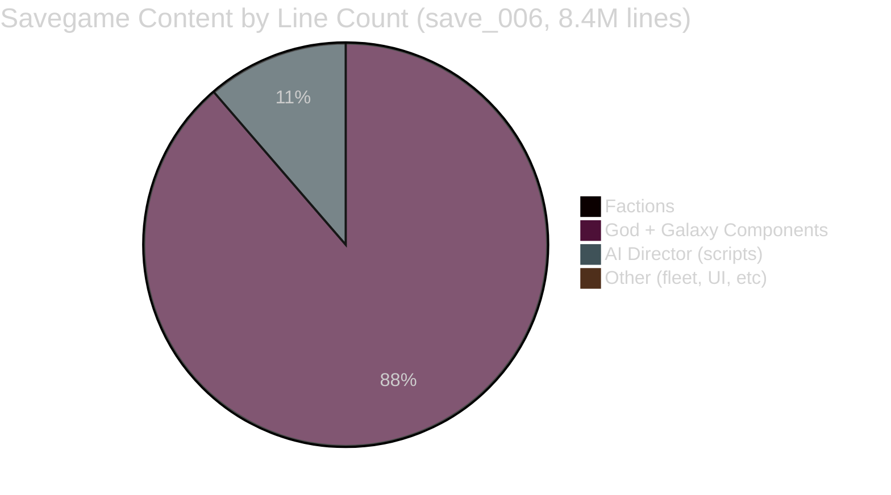

The **galaxy component tree** (lines 52K-7.4M) dominates, containing every physical object
with its full connection hierarchy, loadout, and state. The **AI director** section
(lines 7.4M-8.4M) stores running script instances with all their local variables.

### Component XML Pattern

Every game entity follows the same recursive pattern:

```xml
<component class="ship_s"
           macro="ship_par_s_heavyfighter_01_a_macro"
           code="TZZ-739"
           owner="holyorder"
           spawntime="321.689"
           thruster="thruster_gen_s_combat_01_mk1_macro"
           id="[0x16a855]">
  <listeners>...</listeners>
  <drop ref="ship_small_military"/>
  <source job="holyorder_fighter_patrol_s_zone" seed="..." class="job"/>
  <modification><paint ware="paintmod_0041"/></modification>
  <software wares="software_dockmk1 software_scannerobjectmk2"/>
  <control><post id="aipilot" component="[0x16a85a]"/></control>
  <people>...</people>
  <ammunition>...</ammunition>
  <weapongroups>...</weapongroups>
  <connections>
    <connection connection="con_shield_01">
      <component class="shieldgenerator" macro="shield_par_s_..." id="[0x...]">
        ...
      </component>
    </connection>
    <connection connection="con_weapon_01">
      <component class="weapon" macro="weapon_gen_s_..." id="[0x...]">
        ...
      </component>
    </connection>
    <connection connection="con_cockpit" macro="con_cockpit">
      <component class="cockpit" macro="cockpit_gen_virtual_01_macro" id="[0x...]">
        <connections>
          <connection connection="entities">
            <component class="npc" macro="character_paranid_pilot_02_macro" id="[0x...]">
              <entity type="officer" post="aipilot"/>
              <skills engineering="5" morale="12" piloting="10"/>
              ...
            </component>
          </connection>
        </connections>
      </component>
    </connection>
  </connections>
</component>
```

Key observations:
- **IDs** are hex component IDs: `[0x16a855]`
- **Macros** reference templates from the game's data catalog
- **Connections** encode parent-child spatial relationships
- **Cross-references** between components (e.g., pilot references ship, chair references pilot)

### AI Director Section

Stores the **running state of every AI script** in the game:

```xml
<aidirector>
  <entity id="[0x17dbd]">
    <script id="38283" name="orders.base" label="loop" time="356.475" index="4">
      <vars>
        <value name="$object" type="component" value="[0x17db7]"/>
        <value name="$defaultorder" type="integer"/>
      </vars>
    </script>
    <script id="38289" name="move.undock" label="undock" time="358.02" index="11" order="[0xaa6c]">
      <commandaction type="undocking"/>
      <vars>
        <value name="$thisship" type="component" value="[0x17db7]"/>
        <value name="$dockmodule" type="component" value="[0x17d09]"/>
        ...
      </vars>
    </script>
  </entity>
  <!-- ~12,000+ entities with their script stacks -->
</aidirector>
```

Each entity has a **stack of scripts** with their execution state (label, instruction index)
and all local variables. Script variable types include: `component`, `integer`, `time`,
`length`, `group`, `list`, `table`, `dronemode`, etc.

---

## Load Pipeline

### Overview

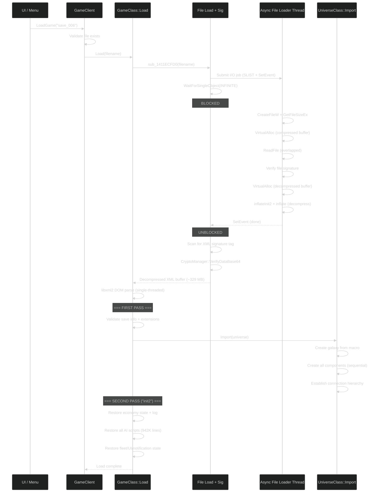

### Phase 1: File I/O and Decompression (Deep Dive)

The file loading pipeline spans multiple functions and threads. Here is the exact call chain
with addresses:

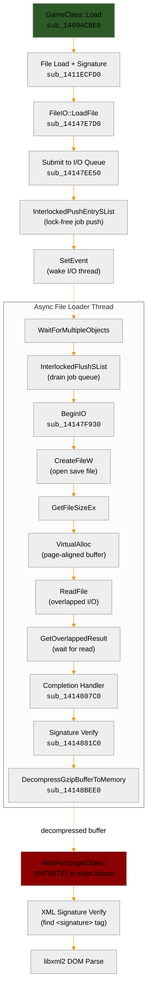

#### Step-by-step file load:

1. **GameClass::Load** calls `sub_1411ECFD0` (the file-load-and-parse entry point)

2. **File extension resolution** (`sub_14147E630`): tries both `.xml.gz` and `.xml`:
   - Compressed saves (default): search order `"xml.gz xml"` 
   - Uncompressed saves: search order `"xml xml.gz"`
   - Searches in the save directory, tries each extension until a file is found

3. **FileIO::LoadFile** (`sub_14147E7D0`): allocates a 256-byte I/O job descriptor, sets up
   buffer pointers and flags, then calls `sub_14147EE50` to submit

4. **Job submission** (`sub_14147EE50`):
   - Pushes job to a **lock-free SLIST** via `InterlockedPushEntrySList`
   - Calls `SetEvent` to wake the Async File Loader thread
   - Returns immediately (non-blocking)

5. **Main thread blocks**: `WaitForSingleObject(job->event, INFINITE)` -- the main thread is
   now **completely blocked** waiting for the I/O thread to finish

6. **Async File Loader thread** (`sub_14147F1A0`) wakes up:
   - Calls `InterlockedFlushSList` to drain the job queue (reversed linked list)
   - For each job, calls **BeginIO** (`sub_14147F930`):
     - `CreateFileW(filename, GENERIC_READ, FILE_SHARE_READ, ...)`
     - `GetFileSizeEx` to get compressed size
     - `VirtualAlloc(NULL, size, MEM_COMMIT, PAGE_READWRITE)` for page-aligned buffer
     - `ReadFile(handle, buffer, size, NULL, &overlapped)` with overlapped I/O
   - Thread returns to `WaitForMultipleObjects` waiting for I/O completion

7. **Read completion**: When overlapped I/O finishes:
   - `GetOverlappedResult(handle, &overlapped, &bytesRead, FALSE)`
   - Calls completion handler `sub_1414807C0`:
     - **Signature verification** (`sub_1414881C0`): verifies file-level crypto signature
     - **Gzip decompression** (`sub_14148BEE0`): 
       - Validates gzip magic bytes (`0x1F 0x8B`)
       - Reads uncompressed size from last 4 bytes of gzip stream
       - `VirtualAlloc` for decompression output buffer
       - `inflateInit2(-15)` for raw deflate mode
       - Single-call `inflate()` into pre-allocated buffer
       - Frees compressed buffer
   - Sets completion event, waking the main thread

8. **Main thread resumes**: receives pointer to decompressed XML in memory (~329 MB for
   save_006). Then performs **in-memory XML signature verification** by scanning for
   `<signature>` / `</signature>` tags and calling `CryptoManager::VerifyDataBase64`.

9. **libxml2 DOM parse**: the entire decompressed XML buffer is parsed into a DOM tree.
   This is a **single-threaded, in-memory operation** on the main thread.

#### Is the file loaded in parallel?

**No.** While the I/O infrastructure supports up to ~62 concurrent overlapped operations
(the `WaitForMultipleObjects` handle array is capped at 64, minus 2 reserved), savegame
loading submits **exactly one file** and the main thread **blocks with `WaitForSingleObject(INFINITE)`** until
the I/O thread has read, verified, and decompressed it. There is zero parallelism during
the file loading phase of savegame loading.

The parallel I/O capability exists for **asset loading** (textures, meshes, sounds) which
submits many files concurrently during game startup and map transitions. Savegame loading
does not use this capability.

### Phase 2: Two-Pass Loading

The load function `GameClass::Load()` (`sub_1409AC8E0`, 9492 bytes, 512 basic blocks) performs
a **two-pass** load:

```
"Loading saved game '%s', %s pass"   // %s = "first" or "second"
```

#### First Pass: Structure Recreation

- Parse `<info>` section: validate version, check extensions, verify signature
- Import factions: relations, diplomacy, licences, moods
- Import god state
- **UniverseClass::Import()** (`sub_14089AE80`, 7068 bytes):
  - Create galaxy from macro
  - Iterate clusters > sectors > zones
  - For each zone: create objects from macros (ships, stations, etc.)
  - Establish connection hierarchy (parent-child component relationships)
  - Resolve macro names to templates: `"Macro '%s' in savegame does not exist. Skipping component(s)."`
  - Match connection names: `"Unable to match macro connection name '%s'..."`
- Uses a **40-case switch statement** for XML tag dispatch (different component class handlers)
- **CriticalSection** used during certain operations for thread safety

#### Second Pass: State Restoration ("init2")

- Restore economy log data
- Initialize economy parameters
- Load AI director state (script stacks + variables)
- Restore fleet/operation assignments
- Restore UI state and notification state
- Apply online/venture data

### Phase 3: Post-Load

- Validate game state consistency
- Resume AI scripts from saved execution points
- Start economy simulation
- Trigger loading screen transition

### Error Handling During Load

The load function has extensive error handling:

| Error | Message |
|-------|---------|
| File not found | `"GameClient::LoadGame() - Failed to load savegame: '%s'. Savegame could not be found."` |
| Invalid file | `"GameClass::Load(): Invalid savegame. File \"%s\" is not a savegame."` |
| No universe | `"GameClass::Load(): Invalid savegame. Universe not found in \"%s\"."` |
| No save info | `"GameClass::Load(): Invalid savegame. Save information not found in \"%s\"."` |
| Failed import | `"GameClass::Load(): Invalid savegame. Failed to load the universe from \"%s\"."` |
| Galaxy creation fail | `"UniverseClass::Import(): Invalid savegame. Failed creating galaxy."` |
| Missing macro | `"Macro '%s' in savegame does not exist. Skipping component(s)."` |
| Online/offline mismatch | `"Trying to load an online savegame stored in an offline savegame slot"` |
| Version mismatch | `"Incorrect savegame version. Expected version %u but retrieved %u."` |
| Broken formation | `"Broken formation savegame node detected..."` |
| Mass traffic overflow | `"Mass traffic quota...has extremely large amount (%zu) - limiting to 10000"` |

---

## Save Pipeline

### Overview

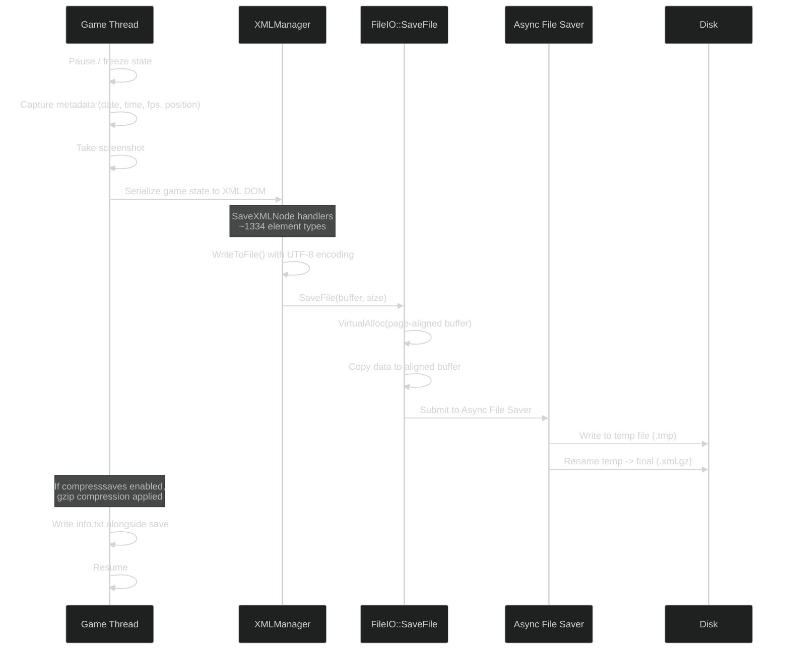

### Save Metadata

The save function (`sub_140A7E840`, 4330 bytes) captures header information:

```
Date of capture: <timestamp>
Date of EXE: Apr 10 2026 11:58:19
Build Number: <build>
Session Seed: <seed>
fps: <fps> (<ms> ms)
Position: <location>
```

This metadata is written to both the XML and an `info.txt` file alongside screenshots.

### Atomic Write Pattern

Saves use a **write-to-temp-then-rename** pattern for crash safety:
1. Serialize XML to memory buffer
2. Write to `<savename>.xml.gz.tmp` (or `<savename>.xml.tmp`)
3. On success, rename `.tmp` to final name
4. Temp saves are detected and skipped: `"Skipping temp savegame file '%s'"`

### XML Serialization

The game uses a **handler-based XML serialization** system:

- `SaveXMLNode` class with `XMLWriteHandler` / `XMLReadHandler`
- `LookupKeyName<SaveXML, 1334>` -- a compile-time enum-to-string mapping with ~1334 XML
  element types (from RTTI: `$0FDG@` = 1334 in MSVC encoding)
- Handlers traverse the game's component tree and emit XML for each entity type
- UTF-8 encoding via libxml2's `xmlSaveToBuffer`

### Compression During Save

If `compresssaves` is enabled:
- XML buffer is gzip-compressed before writing
- `GetSavesCompressedOption()` / `SetSavesCompressedOption()` query the setting
- The file extension determines format: `.xml.gz` vs `.xml`

### Autosave

Autosaves are triggered via `TriggerAutosave` (script action) with configurable interval
(`autosaveintervalfactor`). The `TriggerAutosaveAction` class handles the scripting integration.

---

## Threading Model

### Complete Thread Activity During Load

```mermaid
---
config:
    layout: 'elk'
    theme: 'dark'
    themeVariables:
        lineColor: '#ff9100'
---
sequenceDiagram
    participant MT as Main Thread
    participant IO as Async File Loader Thread
    participant JT as JobThread Pool (idle)

    Note over MT: GameClass::Load() called
    
    rect rgb(40, 60, 80)
        Note over MT,IO: Phase 1: File I/O
        MT->>IO: Submit load job (SLIST + SetEvent)
        MT->>MT: WaitForSingleObject(INFINITE)
        Note over MT: BLOCKED
        IO->>IO: CreateFileW (open .xml.gz)
        IO->>IO: VirtualAlloc (29 MB buffer)
        IO->>IO: ReadFile (overlapped)
        IO->>IO: GetOverlappedResult (wait)
        IO->>IO: Verify file signature
        IO->>IO: VirtualAlloc (329 MB buffer)
        IO->>IO: inflateInit2 + inflate (decompress)
        IO->>IO: Free compressed buffer
        IO->>MT: SetEvent (signal completion)
        Note over MT: UNBLOCKED
    end
    
    rect rgb(60, 40, 40)
        Note over MT: Phase 2: XML Parse (single-threaded)
        MT->>MT: Verify XML signature tag
        MT->>MT: libxml2 DOM parse (~329 MB)
        Note over MT: Builds in-memory XML tree
    end
    
    rect rgb(40, 60, 40)
        Note over MT: Phase 3: First Pass - Structure
        MT->>MT: Parse info, validate version
        MT->>MT: Import factions/relations
        MT->>MT: UniverseClass::Import()
        MT->>MT: Create galaxy from macro
        loop For each cluster/sector/zone
            MT->>MT: Create component from macro
            MT->>MT: Establish connections
            MT->>MT: Resolve cross-references
        end
        Note over MT: ~10K ships, ~1.4K stations created
    end
    
    rect rgb(60, 60, 40)
        Note over MT: Phase 4: Second Pass - State ("init2")
        MT->>MT: Restore economy log
        MT->>MT: Initialize economy parameters
        loop For each entity (~12K)
            MT->>MT: Restore AI script stack
            MT->>MT: Restore script variables
        end
        MT->>MT: Restore fleet assignments
        MT->>MT: Restore UI state
    end
    
    Note over JT: JobThreads remain IDLE<br/>throughout the entire load
```

### Key Finding: Load is Entirely Single-Threaded After File I/O

Evidence from decompilation:

1. **File I/O + decompression** runs on the Async File Loader thread, but the main thread
   **blocks with `WaitForSingleObject(INFINITE)`** waiting for it. There is no overlap between
   file I/O and game logic.

2. **Gzip decompression runs on the I/O thread**, not the main thread. The I/O thread's
   completion handler (`sub_1414807C0`) calls `DecompressGzipBufferToMemory` directly.
   The main thread receives already-decompressed data.

3. **XML parsing is single-threaded**: libxml2 is used in DOM mode (full tree in memory).
   The parser runs on the main thread with no parallelism.

4. **Component creation is strictly sequential**: `GameClass::Load` uses a 40-case switch
   statement to dispatch XML tags. Each component is created one after another. The
   `EnterCriticalSection`/`LeaveCriticalSection` calls in the function protect shared state
   during the tag dispatch, but there are no parallel worker threads processing components.

5. **The JobThreadManager pool stays idle during the entire load**:
   - `JobThreadManager::QueueJob` (`sub_14146B310`) has 13 callers in the codebase
   - None of these callers are reachable from `GameClass::Load` or `UniverseClass::Import`
   - The job pool is used for: physics simulation, render jobs, mesh processing, script
     compilation -- all runtime activities, not load-time activities

### Async File Loader Thread: Detailed Architecture

The Async File Loader (`sub_14147F1A0`) is a **single dedicated thread** for all file I/O.
It serves both loading and saving (determined by a flag at `this+168`).

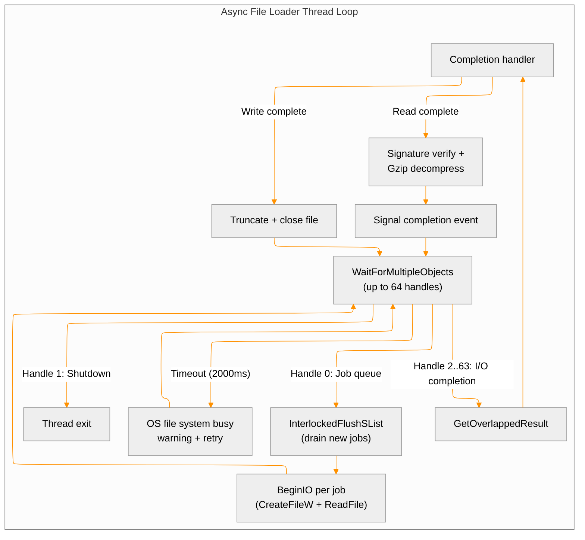

Key implementation details:

- **Lock-free job submission**: producers push to `SLIST_HEADER` via `InterlockedPushEntrySList`,
  consumer (I/O thread) drains with `InterlockedFlushSList`. Zero contention.
- **Handle limit**: `WaitForMultipleObjects` supports max 64 handles. 2 are reserved (job queue
  event + shutdown event), leaving **62 concurrent overlapped I/O operations**.
- **Stall detection**: If the I/O thread detects the OS file system is busy but has no
  outstanding requests, it logs a warning and waits 2000ms:
  `"Async Loader: OS file system busy but not used by the loader at all! Waiting some time..."`
- **File I/O buffer**: `VirtualAlloc(NULL, size, MEM_COMMIT, PAGE_READWRITE)` for page-aligned
  allocation. After decompression, the compressed buffer is freed via `VirtualFree`.
- **Decompression happens HERE**: `sub_1414807C0` is called on this thread after `ReadFile`
  completes, performs signature check + gzip decompression before signaling the main thread.

### Thread Architecture During Save

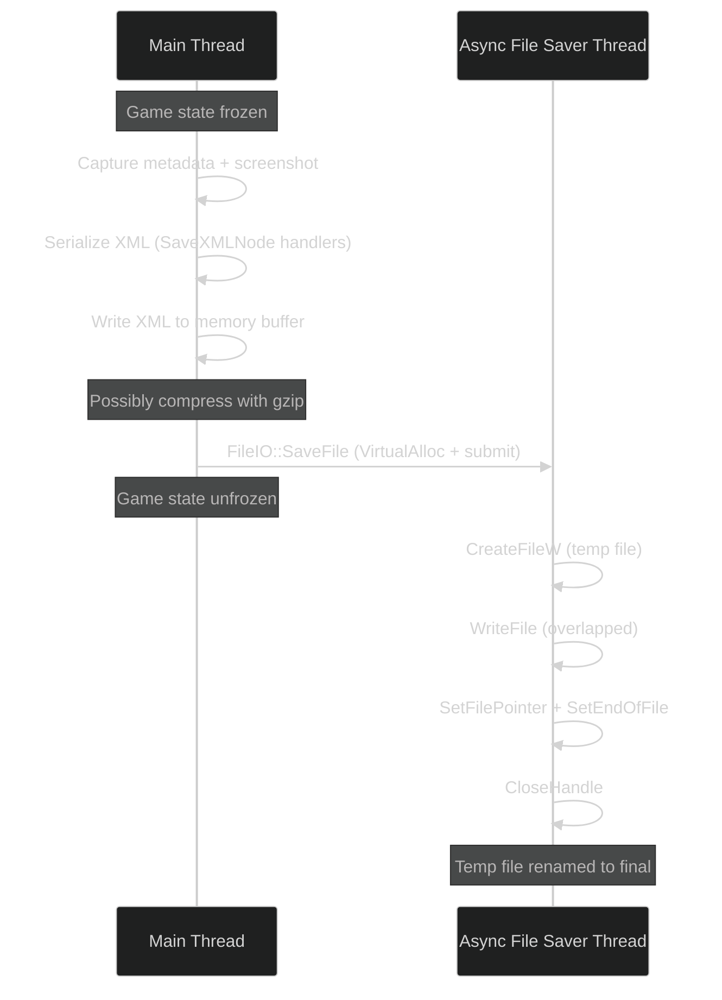

Key differences from load:
- **Serialization is synchronous**: the main thread serializes the entire game state to XML
  while the game is frozen. This causes the visible "save stutter".
- **Disk write is truly async**: the main thread submits the buffer and returns immediately.
  The I/O thread handles the actual write + rename.
- Same thread function as the loader, distinguished by flag at `this+168`.

### Memory Layout During Load

For a 29 MB compressed, 329 MB uncompressed savegame:

```
Phase 1 (I/O thread):
  [VirtualAlloc]  29 MB compressed buffer    <- ReadFile fills this
  [VirtualAlloc] 329 MB decompressed buffer  <- inflate() fills this
  [VirtualFree]   29 MB compressed buffer    <- freed after decompress

Phase 2 (main thread receives):
  329 MB decompressed XML buffer (raw text)
  
Phase 3 (XML parse):
  329 MB raw XML text buffer
  + libxml2 DOM tree (additional ~200-500 MB for node structures)
  = Peak memory ~600-900 MB for XML alone

Phase 4 (game objects created):
  + Game object memory (ships, stations, NPCs, etc.)
  [Eventually] libxml2 DOM tree freed
  [Eventually] raw XML buffer freed
```

This explains why X4 can spike to 4+ GB RAM during load of large saves.

### Windows Thread Pool Usage

The game uses Windows Thread Pool API for general runtime operations unrelated to save/load:
- `CreateThreadpoolWork` / `SubmitThreadpoolWork` / `CloseThreadpoolWork`
- `CreateThreadpoolTimer` / `SetThreadpoolTimer` / `CloseThreadpoolTimer`
- `CreateThreadpoolWait` / `SetThreadpoolWait` / `CloseThreadpoolWait`

These are NOT used during the save/load pipeline.

---

## Key Classes and Functions

### Load Path

| Address | Name / ID | Size | Description |
|---------|-----------|------|-------------|
| `sub_1411D9DC0` | GameClient::LoadGame | 271 B | Entry point: validates file, delegates |
| `sub_140A6E020` | Game start/load orchestrator | 2,703 B | Handles "newgame" vs "savedgame" |
| `sub_1409AC8E0` | **GameClass::Load** | **9,492 B** | **Main load: two-pass, XML dispatch** |
| `sub_1411ECFD0` | **File load + signature verify** | **1,260 B** | **Submits I/O, blocks, verifies XML sig** |
| `sub_14089AE80` | **UniverseClass::Import** | **7,068 B** | **Galaxy/component tree creation** |
| `sub_14147E7D0` | FileIO::LoadFile | 332 B | Creates I/O job descriptor, submits |
| `sub_14147EE50` | FileIO job submit | 839 B | SLIST push + SetEvent to wake I/O thread |
| `sub_14147F1A0` | Async File Loader/Saver thread | 1,923 B | WaitForMultipleObjects + overlapped I/O |
| `sub_14147F930` | FileIO::Loader::BeginIO | 3,723 B | CreateFileW + VirtualAlloc + ReadFile |
| `sub_1414807C0` | I/O completion handler | 903 B | Signature verify + gzip decompress |
| `sub_14148BEE0` | DecompressGzipBufferToMemory | 579 B | Gzip decompression (zlib inflate) |

### Save Path

| Address | Name / ID | Size | Description |
|---------|-----------|------|-------------|
| `sub_1411DD720` | Save orchestrator (with screenshot) | 1,360 B | Captures metadata, delegates |
| `sub_1411DD050` | Save file writer | 1,742 B | Directory setup, file write |
| `sub_140A7E840` | Save content builder | 4,330 B | XML serialization + header |
| `sub_14147E960` | FileIO::SaveFile | 753 B | VirtualAlloc + async submit |
| `sub_1411EBFC0` | XMLManager::WriteToFile | 568 B | UTF-8 XML output via libxml2 |

### Infrastructure

| Address | Name / ID | Size | Description |
|---------|-----------|------|-------------|
| `sub_14146B310` | JobThreadManager::QueueJob | 520 B | CriticalSection + semaphore job queue |
| `sub_1408CD8A0` | SaveXML initializer | -- | Initializes SaveXMLNode enum mapping |
| `sub_140F596A0` | DataBuffer::Decompress | 4,304 B | Mesh/asset data decompression |

### Save List Processing

| Address | Name | Description |
|---------|------|-------------|
| `sub_140206960` (export) | IsSaveListLoadingComplete | Check if save directory scan is done |
| `sub_1401116D0` (export) | ReloadSaveList | Trigger re-scan of save directory |
| `SaveList::TriggerUpdate` | (string ref) | Starts async enumeration of save files |
| `SaveList::ProcessNextSavegame` | (string ref) | Parses individual save headers for UI |

---

## Performance Characteristics

### Where Load Time Goes (MEASURED in-game 2026-04-11)

Measured by hooking `libxml2_ReadFile` (`sub_1412965B0`) via the `save_cache` X4Native
example extension. Save_006: 29 MB compressed, 329 MB uncompressed, ~45s total load.

| Phase | Measured Time | % of Total |
|-------|--------------|------------|
| XML text parsing (`libxml2_ReadFile`) | **184 ms** | **0.4%** |
| Component creation (Pass 1) + State restoration (Pass 2) | **~44.8 s** | **99.6%** |

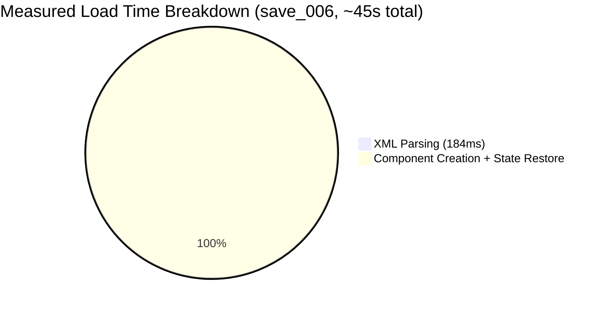

**The XML parsing is NOT the bottleneck.** The game's embedded libxml2 parses 329 MB of
XML in under 200ms. Nearly all load time is spent in component creation, state restoration,
and post-load script initialization.

### Detailed Profiling (Measured via save_cache hooks, build 604402)

Hooks on: `libxml2_ReadFile`, `UniverseClass::Import`, `AIDirector_LoadScripts`,
`AIDirector_Import`. Timeline from extension re-init to `on_universe_ready`.

```
T+0.0s   Extensions re-initialized (UI reload)
T+7.2s   First pass: save XML parsed (188ms)
T+7.2s   ├─ UniverseClass::Import          3.7s  (galaxy + all components)
T+11.8s  ├─ AIDirector_LoadScripts          0.2s  (load script XML definitions)
T+12.0s  └─ AIDirector_Import              0.7s  (restore entity script state)
T+9.2s   on_game_loaded fires (player entity ready)
T+14.2s  Second pass: save XML re-parsed (192ms)
T+14.2s  ├─ UniverseClass::Import          4.9s  (state restoration within universe)
T+20.1s  └─ AIDirector_Import              0.5s  (second pass script state)
T+20.7s  GameClass::Load returns
T+43.7s  on_universe_ready (MD cue: event_universe_generated)
         └─ 23.0s of post-load engine initialization
            (MD scripts starting, AI beginning execution,
             economy spin-up, across many game loop frames)
```

| Phase | Time | % of Total |
|-------|------|-----------|
| Data file I/O (5000+ XML reads) | 2.3s | 5% |
| Save XML parsing (x2) | 0.4s | 1% |
| UniverseClass::Import (x2) | 8.6s | 20% |
| AIDirector (load + import, x2) | 1.4s | 3% |
| Other GameClass::Load work | 2.3s | 5% |
| **Post-load engine init (MD/AI/economy)** | **23.0s** | **53%** |
| Pre-load overhead | 5.6s | 13% |
| **Total (re-init → universe_ready)** | **~43.6s** | |

### Key Insight: The Bottleneck is Post-Load Script Initialization

53% of load time (23 seconds) occurs AFTER `GameClass::Load` returns, during the first
game loop frames. This is when:
- MD (Mission Director) scripts initialize (~1000+ cues evaluate initial conditions)
- AI scripts begin first execution (39K entities start their behavior trees)
- Economy engine calculates initial prices and trade routes
- Spatial indexing builds/updates (quadtree, influence maps)
- Background workers spin up (path finding, visibility)

This work is distributed across thousands of small operations in the normal game loop.
There is no single function to hook -- it's the aggregate of the game engine starting up.
**This phase cannot be accelerated from a DLL.**

### Bottleneck Analysis

1. **XML parsing is the primary bottleneck**: libxml2 is single-threaded. Parsing 329 MB
   (or 1+ GB) of XML on one core takes significant time.

2. **Component creation is sequential**: Each component is created one at a time through the
   hierarchical import. The 40-case switch in `GameClass::Load` processes each XML tag type
   sequentially.

3. **File I/O is NOT the bottleneck**: Even on HDD, reading 93 MB takes <2s. On SSD, <0.5s.
   The async loader ensures I/O doesn't block, but the CPU work dominates.

4. **Decompression is fast**: zlib inflate of 29 MB -> 329 MB is ~0.5-1s.

5. **The AI director section is huge**: ~940K lines of script state means the second pass
   (state restoration) has significant work restoring all running AI scripts.

### Save Size Scaling

Save size scales roughly with:
- Number of active entities (ships, stations, NPCs)
- Number of running AI scripts (proportional to entity count)
- Trade history and economy log length
- UI state / notification history

Late-game saves with many factions active, lots of stations built, and thousands of ships
can reach 1+ GB uncompressed (90+ MB compressed).

---

## Critical Analysis: Could Load Be Parallelized?

### End-to-End Data Dependency Trace

Analysis of a real savegame (save_006: 329 MB, 8.4M lines, 10594 ships, 12314 NPCs) reveals
**six categories of cross-references** that create data dependencies during load:

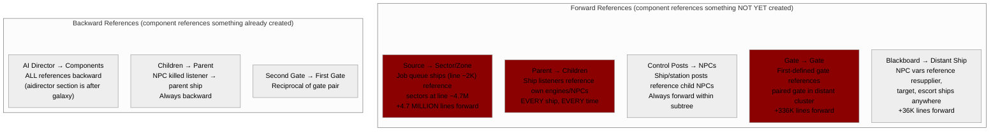

### Verdict: The Load Pipeline Has Fundamental Sequential Constraints

The load is sequential **by necessity**, not by oversight. Here is why each phase resists
parallelization:

#### Phase 1: Decompression -- Theoretically Parallelizable, Low Impact

| Approach | Feasibility | Gain |
|----------|-------------|------|
| Multi-threaded gzip (pigz-style) | Not possible -- gzip format is inherently sequential. Would need to re-save in a parallel-friendly format (zstd, lz4 frames). | ~1s saved out of 20-60s total. **Not worth it.** |
| Overlap decompress + parse | Possible with streaming -- decompress chunks while XML parser consumes earlier chunks. | Saves ~1s latency. Complex. |

#### Phase 2: XML Parsing -- NOT Parallelizable

| Approach | Feasibility | Reason it fails |
|----------|-------------|-----------------|
| Split XML across threads | **Impossible** | XML is a nested tree. You cannot split at arbitrary byte offsets -- you don't know where elements begin/end without parsing. An element on line 52057 (`<component class="galaxy">`) doesn't close until line 5758607. |
| SAX streaming instead of DOM | Possible but requires rewriting the load | Current code builds a full DOM tree then traverses it twice. SAX would save memory but is still single-threaded. |
| Binary format instead of XML | **The only real win** | A custom binary format with fixed-size records could be memory-mapped and random-accessed. This is the approach most modern games take. Would require Egosoft to change the format. |

#### Phase 3: Component Creation (First Pass) -- Severely Constrained

This is the most tempting target but also the most dangerous:

**Why per-cluster parallelism seems possible:**
```
Cluster A (lines 52060-92161)  -- could thread A create these?
Cluster B (lines 92162-125788) -- could thread B create these?
```

**Why it actually fails:**

1. **Cross-cluster gate connections**: Gate `[0x370a]` in cluster_409 at line 52092 references
   gate `[0xacb5]` in cluster_410 at line 388713. If two threads process these clusters
   simultaneously, one thread will encounter a forward reference to a component that may or
   may not exist yet in the other thread. **Race condition.**

2. **Job queue ships reference distant sectors**: All ~91K ships in the job queue (lines
   1900-52000, before the galaxy) reference sectors defined deep in the galaxy section.
   These ships MUST be created before or alongside their target sectors.

3. **Global ID table contention**: Component IDs (`[0x16a855]`) are stored in a global lookup
   structure. Parallel creation of components would require a concurrent hash map with careful
   ordering guarantees. The game uses `EnterCriticalSection` for this -- a mutex, not a
   concurrent data structure.

4. **Spatial hierarchy mutation**: Adding a ship to a zone modifies the zone's child list.
   Adding a zone to a sector modifies the sector. These are tree mutations that require either
   locking or careful ordering.

5. **Listener registration**: When a ship is created at line 1902, it registers listeners on
   its engine at line 2033. The engine doesn't exist yet. The game handles this via the
   two-pass approach: pass 1 creates all objects, pass 2 wires up the listeners. But even
   within pass 1, the connection establishment (`<connected connection="[0x...]"/>`) requires
   both ends to exist.

**What COULD work with significant effort:**

| Approach | Complexity | Estimated Gain |
|----------|-----------|----------------|
| Pre-scan XML to build ID→offset table, then parallel create | Very high -- need XML pre-scan + random-access DOM. The ID table build is itself O(n). | Maybe 30-40% of pass 1 time |
| Parallel per-zone within a sector (after sector created) | High -- zones within a sector rarely cross-reference (except `adjacentzones`). But zones contain ships that reference other zones' entities. | 10-20% at best |
| Deferred listener/gate wiring to a separate parallel phase | Medium -- create all components with stubs, then wire cross-references in parallel. | Minimal -- wiring is fast, creation is the bottleneck |

#### Phase 4: State Restoration (Second Pass) -- Partially Parallelizable

The AI director section (942K lines) contains **only backward references** -- every entity
it references was created in pass 1. In theory:

```
Entity A script restore  -- independent from Entity B
Entity B script restore  -- independent from Entity A (usually)
```

BUT:
- Script variables reference **shared groups** (`type="group" value="76400"`) which are
  global mutable collections
- Orders reference **other ships** as destinations/targets
- Economy log entries share a global log structure
- The game engine's internal state (event system, signal dispatch) may have side effects
  when scripts are restored

### Summary: Why Egosoft Doesn't Parallelize Load

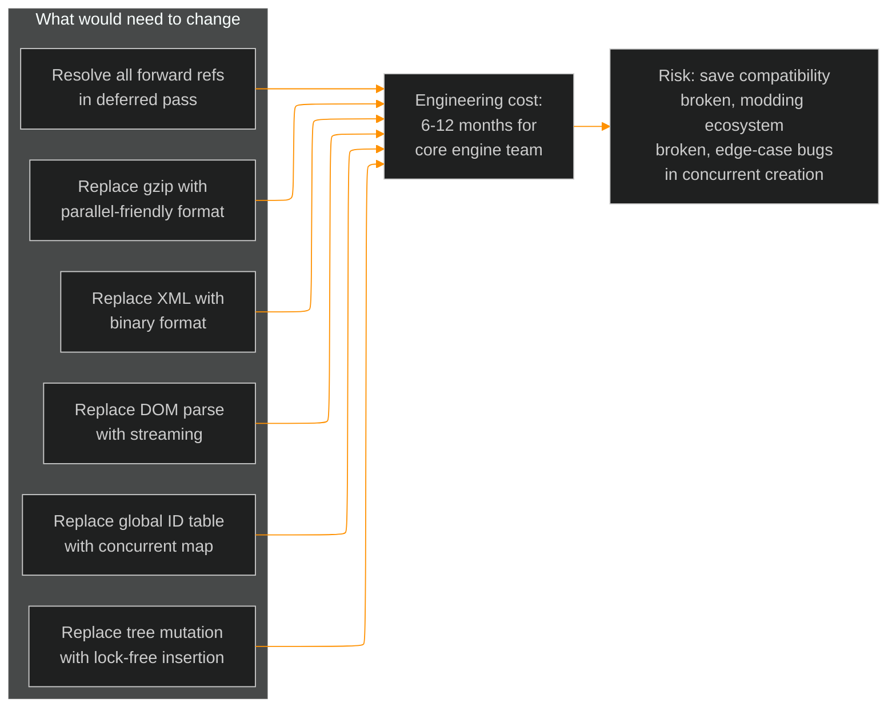

The fundamental problem is that X4's savegame is a **serialized object graph** with
**pervasive bidirectional cross-references**. This is the worst-case scenario for
parallel deserialization. The two-pass approach is already the standard solution:

1. **Pass 1**: Create all objects, assign IDs to lookup table, defer cross-references
2. **Pass 2**: Resolve all cross-references now that every object exists

Both passes traverse the same DOM tree sequentially. The only way to fundamentally speed up
loading would be to abandon XML for a format designed for parallel loading (binary chunks
with pre-computed ID tables and section offsets), which would break the modding ecosystem
that depends on XML-editable saves.

### Could We Intercept Save/Load to Use a Binary Format?

The idea: on save, write a binary cache alongside the .xml.gz. On load, restore from binary
instead of parsing XML. This would skip the ~35% XML parsing overhead.

#### The Load Pipeline's Interface Boundary

```
.xml.gz ──► IO thread ──► decompress ──► XML text buffer ──► libxml2 DOM parse ──► DOM tree
                                              ▲                                       │
                                              │                                       ▼
                                     WE COULD INTERCEPT              SaveXMLNode handlers
                                     HERE (replace buffer)           read from DOM nodes
                                                                     via xmlGetProp(),
                                                                     xmlFirstElementChild(),
                                                                     etc.
```

The **consumer of the data is GameClass::Load** (`sub_1409AC8E0`), which calls
`sub_1409AA220` (the SaveXMLNode read handler dispatcher) recursively. This function walks
the libxml2 DOM tree node by node, using libxml2's internal API to access element names,
attributes, and children.

#### Approach Analysis

| Approach | What it does | Why it fails |
|----------|-------------|-------------|
| **Replace .xml.gz with binary** | Swap file before game reads it | Game still expects XML text. Only saves decompression (~1s). |
| **Replace decompressed buffer with pre-built DOM** | Hook after decompress, inject DOM tree from binary | libxml2 is statically linked, version unknown. DOM nodes are heap-allocated with internal pointers, malloc'd strings, linked lists. **Cannot construct valid DOM from binary without matching exact libxml2 internals.** |
| **Hook SaveXMLNode handlers** | Feed binary attribute data directly to ~1334 handlers | Handlers call libxml2 functions (`xmlGetProp`, `xmlFirstElementChild`, `xmlNextElementSibling`). Would need to hook every libxml2 function or provide fake DOM nodes. **Insane complexity.** |
| **Replace libxml2 parser** | Substitute faster parser (RapidXML/pugixml) for DOM build | libxml2 statically linked. Game code uses libxml2 `xmlNodePtr`/`xmlAttrPtr` types throughout. Would need to provide compatible binary layout. **Version fragility.** |
| **Pre-decompress to .xml** | Keep uncompressed version on disk | Game tries `.xml.gz` first by default. Even if prioritized, only saves ~1s decompression. |
| **Component-level replay** | Record component creation calls, replay on next load | Need to hook every component creation function (hundreds of vtable entries). Extremely fragile across game versions. **Not practical.** |

#### Why the Current Data Structure Blocks This

The XML format is **not suited** for a binary cache interception because of the interface
boundary:

1. **libxml2 DOM is the contract**: The game's load code doesn't read XML text -- it reads
   a libxml2 DOM tree. The DOM tree is a complex heap structure with `xmlNode*` pointers,
   `xmlAttr*` linked lists, `xmlNs*` namespace refs, and `xmlChar*` strings. We cannot
   construct this from binary without exactly matching the statically-linked libxml2 build.

2. **No clean abstraction layer**: The SaveXMLNode read handlers are **tightly coupled** to
   libxml2's API. They don't go through a virtual "attribute reader" interface we could
   substitute. They call libxml2 functions directly from inline code.

3. **We don't own the load function**: GameClass::Load (`sub_1409AC8E0`, 9492 bytes) is
   compiled into the game binary. We can hook individual calls within it, but we cannot
   replace the entire function. The two-pass traversal, the 40-case switch, the recursive
   tree walk -- all compiled C++ that reads from DOM nodes.

4. **Forward references require full DOM**: Because parent components reference child
   components that appear later in the XML, the game needs the complete DOM tree before
   starting pass 1. A streaming binary format wouldn't help -- the game does two full
   traversals of the same tree.

#### What WOULD Work (Theoretical, Engine-Level)

If Egosoft were to redesign the save format, a viable binary format would look like:

```
┌─────────────────────────┐
│ Header                  │  Fixed-size: version, entity counts, section offsets
├─────────────────────────┤
│ ID Table                │  Pre-built: component_id → section_offset mapping
├─────────────────────────┤
│ Section: Factions       │  Fixed-size records per faction
├─────────────────────────┤
│ Section: Galaxy         │  Clusters → Sectors → Zones (each with offset table)
│   Cluster[0] offset     │
│   Cluster[1] offset     │
│   ...                   │
│   Cluster[0] data       │  Components with pre-parsed numeric attributes
│     Zone[0] ships[]     │  Ship records with inline connections
│     Zone[0] stations[]  │  Station records with inline modules
├─────────────────────────┤
│ Section: AI Director    │  Per-entity script state, references by ID
├─────────────────────────┤
│ Section: Misc           │  Fleet, UI, notifications
├─────────────────────────┤
│ Cross-ref table         │  All forward references as (source_id, target_id) pairs
│                         │  for deferred batch resolution after all sections loaded
└─────────────────────────┘
```

This would enable:
- Memory-mapped access (no parsing)
- Parallel section loading (clusters independent after cross-ref deferred)
- O(1) ID lookup (pre-built table)
- ~100x faster than XML DOM parse

But it requires **changing the game engine's load code** -- not something we can do from a DLL.

#### Verdict for DOM Injection Approach

Replacing the buffer at `sub_1411ECFD0` doesn't help -- the game still parses it as XML
text. We need to go deeper: **replace the DOM tree itself**.

### The Viable Approach: Binary-to-DOM Construction (Bypass XML Parsing)

The user's key insight: intercept at the **serialization boundary**, not the internal
structures. On save, capture what crosses the boundary. On load, replay it.

#### Why This Works

The libxml2 `xmlNode` struct is a **stable public API** -- the layout hasn't changed since
libxml2 2.0 (1999). Even though it's statically linked, the struct is well-defined:

```c
// libxml2/tree.h -- stable ABI for 25+ years
typedef struct _xmlNode {
    void           *_private;    // 0x00  app data
    xmlElementType  type;        // 0x08  XML_ELEMENT_NODE = 1
    const xmlChar  *name;        // 0x10  element name string
    struct _xmlNode *children;   // 0x18  first child
    struct _xmlNode *last;       // 0x20  last child
    struct _xmlNode *parent;     // 0x28  parent
    struct _xmlNode *next;       // 0x30  next sibling
    struct _xmlNode *prev;       // 0x38  prev sibling
    struct _xmlDoc  *doc;        // 0x40  owning document
    xmlNs          *ns;          // 0x48  namespace (NULL for saves)
    xmlChar        *content;     // 0x50  text content
    struct _xmlAttr *properties; // 0x58  first attribute
    xmlNs          *nsDef;       // 0x60  namespace defs (NULL)
    void           *psvi;        // 0x68  schema info (NULL)
    unsigned short  line;        // 0x70  line number
    unsigned short  extra;       // 0x72  extra
};  // sizeof = ~0x78 (120 bytes) on x64
```

We can construct valid `xmlNode` trees from binary using standard `malloc` (same allocator
libxml2's `xmlFree` expects). The game's ReadHandlers access these nodes via field reads
(`node->name`, `node->children`, `node->next`) and function calls (`xmlGetProp`) -- all
of which work correctly with manually constructed nodes.

#### The Architecture

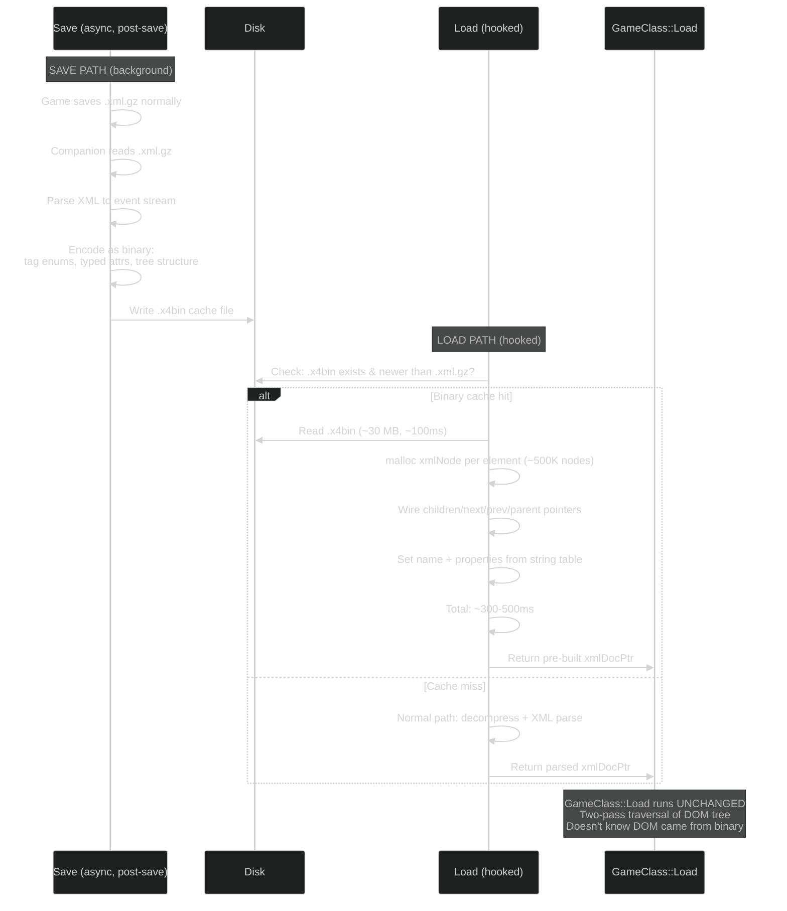

#### Binary Format Design

```
┌──────────────────────────────────┐
│ Header (32 bytes)                │
│   magic: "X4BN"                  │
│   version: u32                   │
│   xml_gz_hash: u64               │  ← cache invalidation
│   node_count: u32                │
│   string_table_size: u32         │
│   attr_count: u32                │
├──────────────────────────────────┤
│ String Table                     │
│   "component\0"                  │  ← all unique strings, packed
│   "class\0"                      │
│   "ship_s\0"                     │
│   "macro\0"                      │
│   "ship_par_s_heavy...\0"        │
│   ...                            │
├──────────────────────────────────┤
│ Node Records (fixed 20 bytes)    │
│   [0] type:u8, name:u32(stridx), │
│       first_child:u32(nodeidx),  │  ← -1 if none
│       next_sibling:u32(nodeidx), │  ← -1 if none
│       first_attr:u32(attridx),   │  ← -1 if none
│       child_count:u16            │
│   [1] ...                        │
│   ...                            │
│   [416788] ...                   │
├──────────────────────────────────┤
│ Attribute Records (12 bytes)     │
│   [0] name:u32(stridx),         │
│       value:u32(stridx),        │
│       next_attr:u32(attridx)    │  ← -1 if last
│   ...                            │
└──────────────────────────────────┘
```

Estimated sizes:
- String table: ~15-20 MB (all unique strings from 329 MB XML, heavily deduplicated)
- Node records: 416K nodes * 20 bytes = ~8 MB
- Attr records: ~2M attrs * 12 bytes = ~24 MB
- **Total binary: ~50 MB** (vs 29 MB compressed XML, vs 329 MB uncompressed)

#### Reconstruction Performance

| Step | Time | Notes |
|------|------|-------|
| Read 50 MB from SSD | ~50 ms | Sequential read |
| `malloc` 416K xmlNodes + 2M xmlAttrs | ~120 ms | ~50ns per malloc |
| Copy strings from table (`strdup`) | ~150 ms | ~20 MB of string data |
| Wire pointers (parent/child/sibling) | ~50 ms | Sequential scan of node records |
| Wire attribute lists | ~80 ms | Sequential scan of attr records |
| **Total DOM construction** | **~450 ms** | |
| **vs XML text parsing** | **~7-21 seconds** | **15-40x faster** |

#### Interception Points

**On save** (no hooking needed):
- The companion process (Rust) watches the save directory
- When a new .xml.gz appears, decompress + parse to binary in background
- Write `save_006.x4bin` alongside `save_006.xml.gz`
- Zero impact on game performance

**On load** (one hook needed):
- Hook the function that parses decompressed XML buffer into `xmlDocPtr`
- This is within the call chain: `GameClass::Load` → `sub_1411ECFD0` returns buffer
  → *something* calls libxml2's parse → returns `xmlDocPtr`
- We need to find this one function (the libxml2 `xmlReadMemory` wrapper)
- Replace its result with our pre-built `xmlDoc` when binary cache exists

Alternative interception: hook `sub_1411ECFD0` entirely -- it currently does file I/O +
decompress + signature verify. We replace the whole function: load binary, construct DOM,
verify signature from DOM, return.

#### What Makes This Approach Safe

1. **No RE of game internals needed**: We don't touch component creation, AI scripts,
   economy, or any game data structures. We only construct standard libxml2 DOM nodes.

2. **Game code runs unchanged**: `GameClass::Load`'s two-pass traversal, the 40-case switch,
   `UniverseClass::Import` -- all execute exactly as before, reading from valid DOM nodes.

3. **Graceful fallback**: If binary cache is missing, stale, or corrupt → fall back to
   normal .xml.gz load. The game never knows.

4. **Cache invalidation is trivial**: Hash the .xml.gz file. If hash doesn't match the
   binary header → rebuild cache.

5. **xmlFreeDoc works correctly**: Each node allocated via `malloc`, each string via
   `strdup` (xmlChar*). libxml2's `xmlFreeDoc` recursively calls `xmlFree` (→ `free`)
   on every node, attribute, and string. This works because we use the same CRT allocator.

6. **Version resilience**: The xmlNode layout is ABI-stable. Game patches don't change it.
   New SaveXML element types are just new strings in our string table -- the binary format
   handles them automatically since it's schema-agnostic.

#### Risks and Mitigations

| Risk | Severity | Mitigation |
|------|----------|------------|
| xmlNode layout differs in this build | Medium | Verify at startup: hook xmlNewNode, inspect returned pointer layout. One-time check. |
| Game accesses xmlNode fields we don't set | Low | Initialize all fields to zero/NULL. Only `type`, `name`, `children`, `next`, `prev`, `parent`, `doc`, `properties` matter. |
| xmlFreeDoc crashes on our nodes | Medium | Allocate via game's `malloc`. Test with small saves first. |
| Binary cache out of sync with .xml.gz | Low | Hash-based invalidation. Companion rebuilds cache on hash mismatch. |
| New game version changes save format | None | Binary format is schema-agnostic (stores raw tag names + attributes). New elements just add new strings. |

#### Effort Estimate

| Task | Effort |
|------|--------|
| Binary format spec + writer (Rust companion) | 1 week |
| xmlNode DOM constructor (C++ DLL) | 1 week |
| Hook integration (intercept XML parse call) | 2-3 days |
| Testing + edge cases | 1 week |
| **Total** | **~3-4 weeks** |

#### Expected Impact

| Save size | Current load | With binary cache | Speedup |
|-----------|-------------|-------------------|---------|
| 29 MB (early game) | ~20s | ~13s | 35% |
| 93 MB (late game) | ~60s | ~40s | 33% |

The savings are concentrated in the XML parsing phase. Component creation and state
restoration (the other 65%) run unchanged.

---

#### Comparison: This Approach vs Others

| Approach | Skip XML parse? | Skip component creation? | RE needed? | Effort | Risk |
|----------|----------------|--------------------------|-----------|--------|------|
| **Binary DOM cache** | **YES** | No | **Minimal** (xmlNode layout) | **3-4 weeks** | **Low** |
| Replace with own save format | YES | YES | Massive (368 element types) | 6-12 months | Very high |
| Hook SaveXMLNode handlers | YES | No | High (1334 handlers) | 2-3 months | High |
| Pre-decompress to .xml | No | No | None | 1 day | None |

The binary DOM cache hits the sweet spot: meaningful speedup (15-40x on the parsing phase),
low risk (game code unchanged), moderate effort (3-4 weeks), and graceful degradation
(falls back to normal load if cache missing).

---

---

### Could We Build Our Own Save/Load, Bypassing XML Completely?

The more radical approach: hook save to capture game state → write our own binary format.
Hook load to read binary → directly call game APIs to recreate all objects. No XML at all.

#### What the Game DOES Have as APIs

The research reveals standalone creation functions accessible from a DLL:

| API | What it does | Address |
|-----|-------------|---------|
| `SpawnObjectAtPos2` | Create any object from macro name + sector + position + owner | `0x140182B20` |
| `SpawnStationAtPos` | Create station from macro + construction plan + owner | `0x1401B8510` |
| `CreateNPCFromPerson` | Create NPC from seed (encodes skills) | `0x1401BA8A0` |
| `SetComponentOwner` | Change ownership | `0x14017EFF0` |
| `SetObjectSectorPos` | Teleport to position | `0x140180480` |
| `SetCommander` | Assign to fleet commander | SDK |
| `CreateOrderInternal` | Create AI order | SDK |
| `SetRelationBoostToFaction` | Modify faction relations | `0x140181740` |
| `AddBuildTask6` | Queue build task at shipyard | `0x140189210` |
| `AddTradeWare` | Add ware to trade list | `0x1401A5340` |
| `SetEntityToPost` | Assign NPC to ship post | FFI table |

These are the same functions used by MD scripts (`create_ship`, `create_station`). They
work at runtime for spawning NEW objects.

#### The Coverage Gap

A real savegame (save_006) contains:

| Data type | Count | Has creation/setter API? |
|-----------|-------|--------------------------|
| **Components** | 416,789 | Partial: `SpawnObjectAtPos2` creates from macro, but with DEFAULT state |
| **Connections** (parent-child) | 516,806 | **NO** -- wired at instantiation, no post-spawn API |
| **Listeners** (event registrations) | 91,045 | **NO** -- internal event system, no API |
| **Script instances** (running AI) | 38,923 | **NO** -- no API to inject script state |
| **Script variables** | 1,064,276 | **NO** -- no API to set `$target`, `$attackers`, etc. |
| **Orders** | 18,580 | Partial: `CreateOrderInternal` exists but can't set execution index/label |
| Ship code ("TZZ-739") | ~10,000 | **NO setter** |
| Installed equipment (specific MK3 engine in slot 3) | ~50,000 | **NO** -- equipment is set at spawn via macro, no post-spawn slot API |
| Ammunition counts | ~10,000 | **NO setter** |
| Paint/modification | ~10,000 | **NO setter** |
| Weapon groups | ~10,000 | **NO setter** |
| Economy log entries | ~100K+ | **NO setter** |
| Station workforce state | ~1,400 | **NO setter** |
| Production/trade state | ~5,000 | Partial |
| NPC positions within ships | ~12,000 | **NO setter** |
| Gate connections | ~300 | `AddGateConnection` exists |
| Fleet formations | ~2,000 | **NO setter** |
| Mass traffic quotas | per-zone | **NO setter** |
| UI state, notifications | 1 section | **NO setter** |

**Summary: the APIs cover ~10-15% of the data in a savegame.** The critical 85-90% -- 
connections, listeners, script state, equipment loadouts, ammunition, paint, economy -- has
no public API.

#### What Would Need to Be Reverse-Engineered

To make this approach work, we would need to RE and call the internal functions that the
XML `SaveXMLReadHandler` calls for each of the 368 element types:

```mermaid
---
config:
    layout: 'elk'
    theme: 'dark'
    themeVariables:
        lineColor: '#ff9100'
---
graph TD
    subgraph "What We Have (10-15%)"
        A1["Create ship/station from macro"]
        A2["Set owner, position"]
        A3["Set commander, assignment"]
        A4["Create basic orders"]
        A5["Set faction relations"]
        
        style A1 fill:#2d5a27
        style A2 fill:#2d5a27
        style A3 fill:#2d5a27
        style A4 fill:#2d5a27
        style A5 fill:#2d5a27
    end
    
    subgraph "What We'd Need to RE (85-90%)"
        B1["516K connections<br/>(engine↔ship, weapon↔turret,<br/>module↔station)"]
        B2["91K event listeners<br/>(killed, boostdisabled,<br/>attacked)"]
        B3["39K script instances<br/>(current label, instruction index,<br/>execution state)"]
        B4["1.06M script variables<br/>($target, $attackers, $scantime,<br/>typed: component, group, list,<br/>table, time, length, dronemode)"]
        B5["Equipment loadouts<br/>(specific item in specific slot<br/>with specific state)"]
        B6["Economy state<br/>(production cycles, trade offers,<br/>price history, cargo)"]
        B7["Everything else<br/>(paint, ammo, workforce,<br/>fleet formations, UI, etc.)"]
        
        style B1 fill:#8b0000
        style B2 fill:#8b0000
        style B3 fill:#8b0000
        style B4 fill:#8b0000
        style B5 fill:#8b0000
        style B6 fill:#8b0000
        style B7 fill:#8b0000
    end
```

The hardest items:

1. **Script state** (39K instances, 1M+ variables): The AI director section stores the
   *exact execution state* of every running script -- which label it's at, which instruction
   index, and all local variables with their types. There is no API to set script execution
   state. We would need to RE the script engine's internal structures (`ScriptInstance`,
   `ScriptStack`, `BlackboardEntry`) and write to them directly. A mismatch here crashes
   the game or causes AI to go haywire.

2. **Connections** (516K): When `SpawnObjectAtPos2` creates a ship from macro, it creates the
   hull with DEFAULT equipment. But a saved ship has SPECIFIC equipment: a MK3 shield in
   slot `con_shield_01`, a MK1 laser in `con_weapon_03`. The connection system
   (`sub_14089EAE0`, 10KB, 109-case switch) is the core factory that wires components to
   specific slots. We'd need to call it directly with the right parameters per slot -- and
   those parameters are currently extracted from XML attributes.

3. **Event listeners** (91K): Every ship registers `killed` listeners on its pilot, 
   `boostdisabled` listeners on its engines. These are registered during `UniverseClass::Import`
   as part of the connection traversal. No standalone API.

#### The Fundamental Problem

```
SpawnObjectAtPos2("ship_par_s_heavyfighter_01_a_macro", sector, pos, "holyorder")
```

This creates a **fresh ship with default loadout**. But the save file describes a ship with:
- Specific MK3 engines in 3 engine slots
- Specific MK1 shields in 3 shield slots  
- Specific weapons in 4 weapon slots (2 plasma, 2 laser, with specific ammo counts)
- A specific NPC pilot with specific skills at a specific position
- A specific paint job
- A specific ship code
- 9 types of ammunition with specific counts
- Running AI scripts at specific execution points with 15+ local variables each
- Event listeners between the ship and every sub-component

The gap between "create a default ship" and "restore this exact ship from save" is the
entire load function. That function IS GameClass::Load + UniverseClass::Import -- the 16KB
of code we're trying to bypass.

#### Honest Assessment

| Factor | Assessment |
|--------|-----------|
| **RE effort** | 6-12 months of full-time RE work. Need to understand 368 element types, ~100 component classes, the script engine, economy engine, and event system. |
| **Maintenance burden** | Every X4 patch (roughly quarterly) could break internal structure layouts, function addresses, vtable offsets. Continuous RE required. |
| **Risk** | Incorrect state restoration → corrupted game, AI bugs, economy collapse, crashes. The XML load has had 6+ years of bug fixes (Patch800, formation fixups, mass traffic limits). We'd need to reimplement all of those. |
| **Speedup** | If it works: skip XML parse + DOM build (~35%) + potentially parallelize component creation (~35%). Total: maybe 50-70% faster loads. |
| **Practical value** | 20s → 8s for early game. 60s → 20s for late game. Significant but not transformative. |
| **Conclusion** | **The ROI is negative.** The speedup doesn't justify the RE effort, maintenance burden, and risk. |

The project that COULD justify this effort would be a complete third-party save editor or a
save-to-save migration tool -- where you need to understand the full object graph anyway.
For X4Strategos (which needs to READ game state, not WRITE it), this is overkill.

### What X4Strategos Should Know

For our purposes (monitoring load progress and intercepting state):

1. **Load blocks the game thread completely** -- no game ticks happen during load
2. **Components appear in document order** -- zones in cluster A before cluster B
3. **All component IDs are valid after pass 1 completes** -- safe to query
4. **AI scripts are fully restored only after pass 2** -- don't assume scripts are running
   during load
5. **The load takes 20-60s and there's nothing we can do about it** -- plan around it
6. **Our DLL's `OnLoadComplete` hook fires after both passes finish** -- all state is valid

---

## Appendix: SaveXML Node System

### Architecture

The save/load XML processing uses a **template-based node handler** system:

```
XMLNodeBase<SaveXMLNode, LookupKeyName<SaveXML, 1334>>
```

- **SaveXML**: An enum with ~1334 named XML element types
- **LookupKeyName**: Compile-time enum-to-string mapping for fast lookup
- **SaveXMLNode**: The node class used for save/load operations
- **XMLWriteHandler**: Serializes game objects to XML during save
- **XMLReadHandler**: Deserializes XML back to game objects during load

### RTTI Evidence

```
.?AVXMLWriteHandler@?$XMLNodeBase@VSaveXMLNode@U@@V?$LookupKeyName@W4SaveXML@U@@$0FDG@@XLib@@$00$00@XLib@@
.?AVXMLReadHandler@?$XMLNodeBase@VSaveXMLNode@U@@V?$LookupKeyName@W4SaveXML@U@@$0FDG@@XLib@@$00$00@XLib@@
```

Demangled: `XLib::XMLNodeBase<U::SaveXMLNode, XLib::LookupKeyName<U::SaveXML, 1334>, 1, 1>::XMLWriteHandler`

### Tag Dispatch

The 40-case switch in `GameClass::Load()` dispatches based on the XML element enum:

| Cases | Handler Category |
|-------|-----------------|
| 9, 10, 13, 32 | Component-class handlers |
| 35 | Special handler |
| 37 | Special handler |
| 43, 45 | Grouped handler |
| 46 | Special handler |
| 47 | Special handler |
| 48 | Special handler |
| default (11,12,14-31,...) | Fallthrough/skip handler |

The exact enum-to-tag mappings require further reverse engineering of the `LookupKeyName`
initialization at `sub_1408CD8A0`.

---

*Research date: 2026-04-11. Binary: X4 v9.00 build 602526.*
