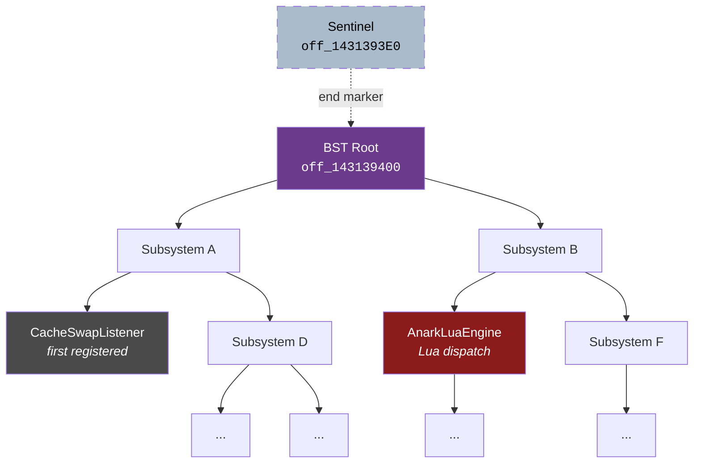
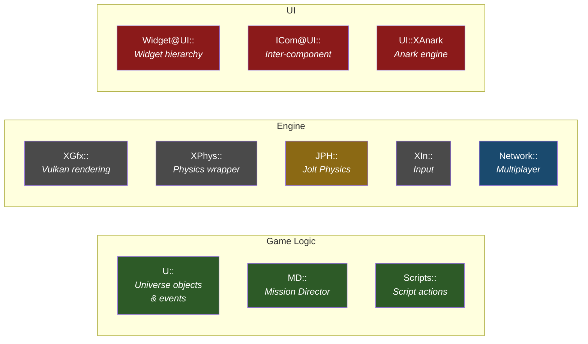
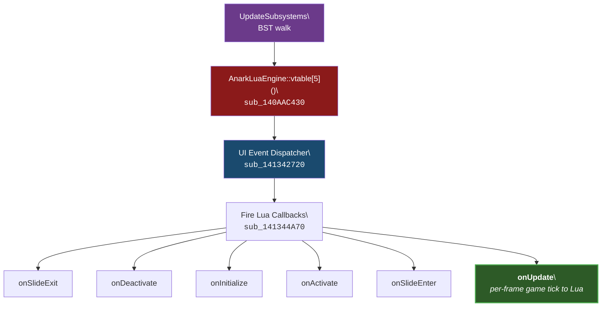
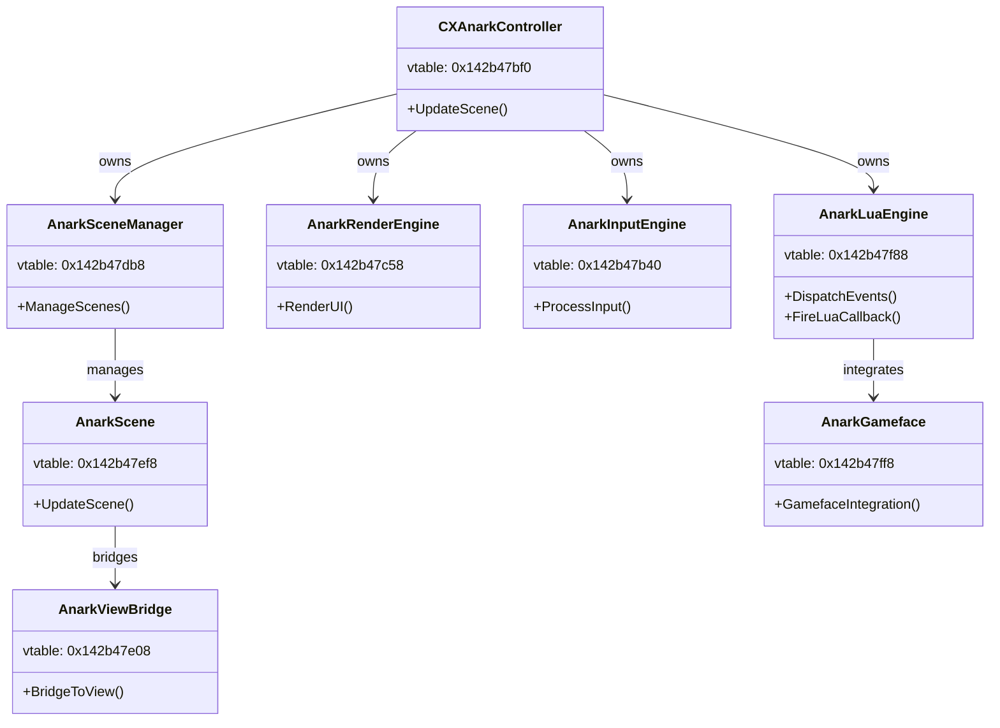
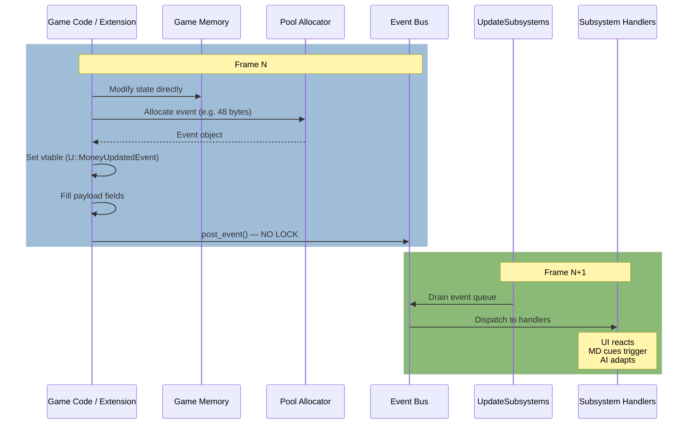
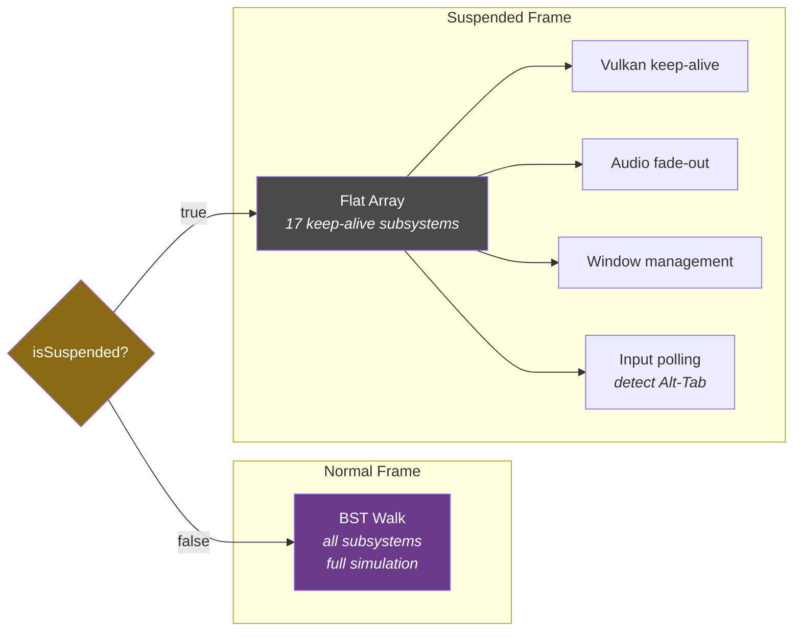

# X4 Subsystem Architecture — Reverse Engineering Notes

> **Binary:** X4.exe v9.00 (build 600626) · **Date:** 2026-03
>
> All addresses are absolute (imagebase `0x140000000`). Subtract imagebase to get RVA.

---

## 1. Summary

X4's simulation is driven by a **binary search tree (BST) of subsystem objects**. Each frame, `UpdateSubsystems` (`sub_140E999D0`) walks this tree and calls each subsystem's virtual update method. This single mechanism powers all game logic — MD cues, AI, UI, events, trade, combat — everything.

---

## 2. BST Structure



> The tree structure above is illustrative — actual node ordering depends on registration order and BST key comparisons. The walk is in-order (left → node → right).

### Globals

| Address | Purpose |
|---------|---------|
| `off_143139400` | BST root pointer |
| `off_1431393E0` | BST sentinel / end node |

### Node Layout

Each BST node is a subsystem object with a vtable. The tree is walked in-order (left → node → right), and each node's update is dispatched via:

```c
node->vtable[1](node);   // offset +8 in vtable
```

### Known Subsystem — CacheSwapListener

The first subsystem registered into the BST is `CacheSwapListener` (identified via RTTI). This is a low-level cache management subsystem that runs before any game logic.

---

## 3. Update Dispatch (sub\_140E999D0)

### Function: UpdateSubsystems

**Address:** `0x140E999D0` (RVA `0xE999D0`)

This is the entire game simulation in a single function call:

```c
void UpdateSubsystems() {
    // Thread safety check
    if (is_main_thread()) {           // TLS + 0x788
        // Normal path: walk BST, call each subsystem
        Node* node = bst_first(root);
        while (node != sentinel) {
            node->vtable[1](node);    // subsystem update
            node = bst_next(node);
        }
    } else {
        // Cross-thread path (should never happen in practice)
        EnterCriticalSection(&cs);
        signal_main_thread();
        WaitForSingleObject(event, INFINITE);
        LeaveCriticalSection(&cs);
    }
}
```

### Normal Frame vs Suspended Frame

| Mode | Update Mechanism | What Runs |
|------|-----------------|-----------|
| **Normal** (`!isSuspended`) | Full BST walk via `sub_140E999D0` | All subsystems — game logic, AI, MD, UI, events |
| **Suspended** (`isSuspended`) | Flat array of 17 subsystems at `qword_146C6B9A0 + 136` | Keep-alive only — minimal rendering, no simulation |

The suspended-mode array is a separate data structure from the BST. It contains only the subsystems needed to keep the Vulkan renderer alive when the game is minimized or lost focus.

---

## 4. RTTI Namespace Map

RTTI type information strings recovered from the binary reveal the engine's namespace organization:



### Game Logic Namespaces

| Namespace | Purpose | Examples |
|-----------|---------|----------|
| `U::` | **Game universe objects and events** | `U::MoneyUpdatedEvent`, `U::UnitDestroyedEvent`, `U::UniverseGeneratedEvent`, `U::UpdateTradeOffersEvent`, `U::UpdateBuildEvent`, `U::UpdateZoneEvent` |
| `MD::` | **Mission Director** | MD cue processing, condition evaluation, script actions |
| `Scripts::` | **Script actions** | Implementations of MD/AI script commands |

### Engine Namespaces

| Namespace | Purpose | Examples |
|-----------|---------|----------|
| `XGfx::` | **Graphics / rendering** | Vulkan pipeline, shader management |
| `XPhys::` | **Physics** | Physics simulation wrapper | 
| `JPH::` | **Jolt Physics** | `JobSystem@JPH@@` — physics thread pool |
| `XIn::` | **Input** | Keyboard, mouse, gamepad handling |
| `Network::` | **Networking** | Multiplayer, Venture online |

### UI Namespaces

| Namespace | Purpose | Key Classes |
|-----------|---------|-------------|
| `Widget@UI::` | **UI widgets** | Widget hierarchy, layout |
| `ICom@UI::` | **UI communication** | Inter-component messaging |
| `UI::XAnark` | **Anark UI engine** | See class hierarchy below |

---

## 4b. Universe Hierarchy — Zones and Entity Containment

X4's spatial hierarchy for the game universe:

```
Galaxy (xu_ep2_universe_macro)
  └── Cluster (cluster_01, cluster_02, ...)
        └── Sector (cluster_01_sector001_macro, ...)
              └── Zone (zone001_cluster_01_sector001_macro, ...)
                    └── Entity (station, ship, asteroid, ...)
```

### Static vs Dynamic Zones

**Static zones** are pre-defined in the base game universe data. Each sector contains one or more named zones following the pattern `zone{NNN}_cluster_{NN}_sector{NNN}_macro`. These are referenced in `libraries/god.xml` as spawn locations for factions.

**Tempzones** are created dynamically by the engine when an entity is spawned into a sector at a position with no existing zone. All entity creation APIs (`create_station`, `create_ship`, `create_object` in MD; `SpawnStationAtPos`, `SpawnObjectAtPos2` in C++) auto-create tempzones when given a sector + position.

From `common.xsd` (MD action schema), the `sector=` attribute documentation:
> "Sector to create the station in using position in the sector space. **Creates a tempzone if a zone does not exist at the coordinates**"

This pattern is consistent across all entity creation actions.

### Zone API Functions

| Function | Signature | Use |
|----------|-----------|-----|
| `GetZoneAt` | `(UniverseID sectorid, UIPosRot* uioffset) → UniverseID` | Find zone at a position (0 if none) |
| `GetPlayerZoneID` | `() → UniverseID` | Current player zone |
| `IsZone` | `(UniverseID componentid) → bool` | Type check |
| `GetContextByClass` | `(UniverseID componentid, const char* classname, bool includeself) → UniverseID` | Navigate hierarchy: `GetContextByClass(entity, "zone", false)` |

### DLC Cluster Ranges

All DLCs add clusters into the same `xu_ep2_universe_macro` galaxy. Cluster numbering by DLC:

| DLC | Cluster Range | Notes |
|-----|--------------|-------|
| Base game | 01–49 | Core sectors (Argon, Paranid, Holy Order, etc.) |
| Cradle of Humanity (Terran) | 100–115 | Terran, Segaris, Sol system |
| Split Vendetta | 400–414 | Zyarth, Free Families space |
| Tides of Avarice (Pirate) | 500–502 | Pirate, Vigor space |
| Kingdom End (Boron) | 600–609 | Boron space |
| Timelines | 700–703 | Timeline-specific sectors |

If a host and client have different DLCs installed, sectors from missing DLCs will not exist on the client side. The sector macro names exist but the macro data (from DLC files) is required to instantiate them. `AddCluster`/`AddSector` APIs exist for runtime creation but require the DLC data files to be installed.

### Zone Creation Rules

- No explicit `CreateZone` or `SpawnZone` API exists (checked all 2,051 exported functions)
- Zone creation is exclusively implicit — triggered by entity spawn into a zoneless sector position
- The `zone=` attribute on spawn actions "takes precedence from sector" — use it to place entities in a specific existing zone
- Component class IDs: sector=86, zone=107, station=96, ship=115

---

## 5. AnarkLuaEngine — The Lua Bridge Subsystem

The Anark UI engine is the subsystem responsible for all Lua execution. It sits within the BST and is called each frame as part of the subsystem walk.

### Vtable: `0x142b47f88`

| Index | Address | Purpose |
|-------|---------|---------|
| `[0]` | `0x140AABA60` | Destructor or base method |
| `[1]` | `0x141342080` | String/memory management |
| `[2]` | `0x1413423C0` | — |
| `[3]` | `0x141342050` | — |
| `[4]` | `0x141342920` | — |
| `[5]` | `0x140AAC430` | **Event dispatcher** — fires onUpdate etc. to Lua |
| `[6]` | `0x141342980` | — |
| `[7]` | `0x140AABFA0` | — |

### Dispatch Chain



### How AnarkLuaEngine Is Called

The engine is NOT called directly from code — it's called **only via vtable dispatch** from the BST walk. Cross-references to vtable[5] (`0x140AAC430`):

| Address | Location | Type |
|---------|----------|------|
| `0x142b47fb0` | AnarkLuaEngine vtable entry | Data (vtable slot) |
| `0x146cfb42c` | Runtime structure | Data |
| `0x146cfb438` | Runtime structure | Data |

No direct `call` instructions target this function — confirming it's purely a virtual dispatch target.

### Lua Global Function Registration Table

**Address:** `sub_140236710` — 15,705 bytes (0x3D59), the largest function in the Lua registration path.

This function registers ALL bare Lua globals (`GetPlayerRoom`, `SetOrderParam`, etc.) by mapping them to native C handler functions. The repeating pattern:

```asm
lea rdx, sub_XXXXXXXX       ; native C handler function pointer
xor r8d, r8d                ; upvalue count = 0
call lua_pushcclosure        ; push C closure onto Lua stack
mov rcx, cs:qword_1438731E0 ; Lua state global
lea r8, aFunctionName       ; "FunctionName" string literal
mov edx, 0FFFFD8EEh         ; stack index (relative)
call lua_setfield            ; register as global in Lua state
```

**Lua state global:** `qword_1438731E0` — pointer to the Lua VM state.

**How to find any Lua global's native handler:**
1. Search for the function name string (e.g., `find string "GetPlayerRoom"`)
2. Get the string address
3. Find xrefs to that string — should be in `sub_140236710`
4. Look 2 instructions before the `lua_setfield` call for `lea rdx, sub_XXXXXXXX` — that's the native handler

**Known mappings discovered via this table:**

| Lua Name | Native Handler | Notes |
|----------|---------------|-------|
| `GetPlayerRoom` | `sub_14024D880` | Class 82 parent chain walk |
| `SetOrderParam` | `sub_1402885C0` | 298 insns, Lua-only (no C++ callers) |
| `RemoveOrderListParam` | `sub_140288A40` | Order parameter removal |
| `TransferPlayerMoneyTo` | `sub_14024D950` | Money transfer handler |

### Ownership



---

## 6. Event System — Typed C++ Events

Game state changes are communicated via typed event objects posted to an event bus.

### Event Posting

```c
// sub_140953650 — post_event
void post_event(EventBus* bus, Event* event) {
    // NO LOCKING — single-producer (main thread)
    bus->queue[bus->count++] = event;
}
```

### Known Event Types (from RTTI)

| Event Class | Size | Description |
|-------------|------|-------------|
| `U::MoneyUpdatedEvent` | 48 bytes | Player money changed |
| `U::UpdateTradeOffersEvent` | — | Trade offers recalculated |
| `U::UpdateBuildEvent` | — | Construction state changed |
| `U::UpdateZoneEvent` | — | Zone ownership/state changed |
| `U::UnitDestroyedEvent` | — | Entity destroyed |
| `U::UniverseGeneratedEvent` | — | Universe generation complete |

### Event Lifecycle



---

## 7. Suspended-Mode Subsystems

When `isSuspended == true`, the BST walk is skipped. Instead, a flat array of 17 subsystems is iterated:



**Location:** `qword_146C6B9A0 + 136`

These subsystems keep the engine alive without running game logic:
- Vulkan keep-alive (prevent device lost)
- Audio fade-out
- Window management
- Input polling (to detect Alt-Tab back)

The exact identity of all 17 subsystems has not been determined — runtime analysis would be needed to enumerate them.

---

## 8. Component System

Entity lookup uses a global component system:

**Global:** `qword_146C6B940` — component system root

```c
// Reconstructed from CreateOrder3 decompilation
void* lookup_component(uint64_t component_id) {
    // Direct lookup via component system — NO LOCKING
    return component_table[component_id];
}
```

This is the same system used by all exported functions that take entity/component IDs. It's a flat lookup table — no tree traversal, no hash map, just index-based access (extremely fast, no allocation).

---

## 9. Function Reference

| Name | Address | RVA | Purpose |
|------|---------|-----|---------|
| UpdateSubsystems | `0x140E999D0` | `0xE999D0` | BST walk — entire game simulation |
| AnarkLuaEngine dispatch | `0x140AAC430` | `0xAAC430` | Vtable[5] — Lua event dispatch |
| UI Event Dispatcher | `0x141342720` | `0x1342720` | Fires onUpdate etc. |
| Fire Lua Callback | `0x141344A70` | `0x1344A70` | lua_getfield + lua_pcall |
| Event bus post | `0x140953650` | `0x953650` | Post event (no lock) |
| sub_1409A4830 | `0x1409A4830` | `0x9A4830` | NewGame world init (called by U::NewGameAction) |
| GameStartDB::Import | `0x1409D39B0` | `0x9D39B0` | Parses gamestart XML, reads `nosave` tag from `tags` attribute |
| sub_14088D4B0 | `0x14088D4B0` | `0x88D4B0` | Galaxy creation from gamestart XML |
| BST root | `0x143139400` | — | Subsystem tree root pointer |
| BST sentinel | `0x1431393E0` | — | Subsystem tree end node |
| Suspended array | `0x146C6B9A0 + 136` | — | 17 keep-alive subsystems |
| Component system | `0x146C6B940` | — | Entity lookup table |
| IsNewGame sentinel | `0x143C97650` | — | Global: 0 = new game, non-zero = save ID |
| U::NewGameAction RTTI | `0x1431c50b8` | — | RTTI for the new-game action object |
| nosave string | `0x142b37f68` | — | Literal "nosave" parsed by GameStartDB::Import |
| Entity_AttachToParent | `0x140397C50` | `0x397C50` | Core hierarchy reparent (26 callers, NOT exported) |
| ClassName_StringToID | `0x1402D4130` | `0x2D4130` | Maps class name string to numeric ID; BST at `0x1438D2568` |

---

## 10. World Initialization — NewGame vs. Load

X4 has exactly two paths that initialize a live game world. Both end at the same point (`U::UniverseGeneratedEvent` → `on_game_loaded`) and are indistinguishable to code running after that event fires. Note: `on_game_loaded` fires when the world is structurally ready (entity IDs valid, game functions safe), but gamestart MD cues (e.g., `set_known`, faction setup) have NOT yet completed. The later `on_game_started` event (triggered by `event_game_started`) fires after all gamestart MD cues have run.

### Global: `qword_143C97650` — IsNewGame Sentinel

**Address:** `0x143C97650`

This global is the single bit the engine uses to distinguish new games from loaded saves:

```c
bool IsNewGame() {
    return qword_143C97650 == 0;
}
```

- Set to **`0`** by `NewGame()` path (new session)
- Set to **non-zero** (the save ID) by `GameClass::Load()` path

`NotifyUniverseGenerated` checks this to decide whether to run new-game post-init logic vs. load-game restore logic.

### Path A — NewGame (sub_1409A4830)

Called via `NewGame(modulename, numparams, params)` (exported from X4.exe):

```
NewGame("x4online_client", 0, nullptr)
  → U::NewGameAction posted to engine action queue
  → Next frame: sub_1409A4830 runs
    → GUID allocated for session
    → qword_143C97650 = 0          // IsNewGame() = true
    → Physics subsystem reset
    → Galaxy created from gamestart XML (sub_14088D4B0)
    → MD starts, fires event_universe_generated
  → U::UniverseGeneratedEvent posted
  → AnarkLuaEngine processes event
  → X4Native fires on_game_loaded
  → Gamestart MD cues run (set_known, faction setup, etc.)
  → event_game_started fires
  → X4Native fires on_game_started
```

**`U::NewGameAction` RTTI:** `0x1431c50b8`

### Path B — GameClass::Load

Called via `Load(filename)` to deserialize an existing save (`.xml.gz` or `.xml`):

```
GameClass::Load("save01.xml.gz")
  → UniverseClass::Import() — reads XML tree
  → qword_143C97650 = save_id    // IsNewGame() = false
  → Player, entities, economy, factions all restored from file
  → U::UniverseGeneratedEvent posted
  → on_game_loaded fires
  → Gamestart MD cues complete
  → on_game_started fires
```

### Gamestart XML — nosave Tag

A gamestart definition in `libraries/gamestarts/*.xml` drives Path A. Autosave is suppressed by including `nosave` as a space-separated value in the `tags` attribute — **not** as a standalone `nosave="1"` attribute:

```xml
<gamestart id="my_gamestart" tags="nosave" ...>
```

This is confirmed in both the binary and the game files:
- **String address:** `0x142b37f68` — the literal `"nosave"` string, parsed by `GameStartDB::Import`
- **Parsed by:** `GameStartDB::Import` at `0x1409D39B0`
- **Game file evidence:** Every tutorial and workshop gamestart in `libraries/gamestarts.xml` uses `tags="tutorial nosave"` or `tags="stationdesigner nosave"` — no standalone `nosave` attribute exists anywhere in the schema

Extensions place custom gamestarts in `extension/libraries/gamestarts/` — X4 auto-scans all active extensions' `libraries/` directories. Additional recognized tag values include `tutorial`, `customeditor`, `stationdesigner`.

### SetCustomGameStartPlayerPropertySectorAndOffset

Before calling `NewGame`, the starting sector and position can be pre-configured:

```cpp
SetCustomGameStartPlayerPropertySectorAndOffset(
    gamestart_id,    // e.g. "x4online_client"
    property_name,   // e.g. "player"
    entry_id,        // e.g. "entry0"
    sector_macro,    // MACRO NAME string — NOT a UniverseID
                     // e.g. "cluster_01_sector001_macro" (Argon Prime area)
                     //      "cluster_14_sector001_macro" (Second Contact / Holy Vision)
                     // Real names confirmed in gamestarts.xml: all lowercase, no universe prefix
    pos              // UIPosRot
);
```

Note: takes the sector **macro name** string, not a `UniverseID`. Sector macro naming convention: `cluster_NN_sectorNNN_macro` (confirmed from `libraries/gamestarts.xml` v9.00). Use `GetComponentName(sector_universe_id)` on the host to retrieve the macro name for an arbitrary sector.

--- 

## 12. Faction System

### 12.1 Overview

Factions are static data loaded from `libraries/factions.xml` at game start. There is no
runtime `CreateFaction` API — confirmed absent from all 2,359 PE exports, Lua FFI, and
the binary string table.

### 12.2 Runtime Layout

**Global**: `0x146C6BB88` — pointer to `FactionManager` object.

**Faction lookup** — `std::map<FNV1a_hash, FactionData>` BST:
- `FactionManager + 16` — BST sentinel node (begin/end marker)
- `FactionManager + 24` — BST root node pointer (`nullptr` if empty)
- Hash key: FNV-1a 32-bit hash of faction ID string (seed `2166136261`, multiplier `16777619`)
- Tree walk: `if (node[4] < hash) → right child (node[2])`, else `left = node[1]`
- Faction data: at `tree_node + 48` (FactionData is inline in the map node)

**`FactionData` struct** (offsets from `tree_node + 48`):
```
+0    vtable*                 virtual: isHidden() at slot 13 (vtable+104)
+16   faction_id std::string  SSO: inline buffer if size < 16; heap ptr at +16 if size >= 16
+560  numeric_faction_index   DWORD — integer slot ID used in galaxy entity arrays
+640  sub-object*             localization/name data; display name string at sub+1304
```

**Iteration** (`GetAllFactions`, `GetNumAllFactions`): calls `sub_1402D5CF0(FactionManager, &range)`
which builds an ordered range from the BST for in-order traversal.

### 12.3 Galaxy Entity Arrays (Faction-Indexed)

Ships and stations for a faction are not stored inside `FactionData`. They live in a
**pre-allocated flat array** inside the galaxy object:

```
galaxy = *(qword_143C97858 + 552)         // galaxy object
ships  = galaxy[23]                        // = *(galaxy + 184), the ship-list manager
slot   = faction_numeric_index * step + 1  // index into ships array
```

Array stride: 6 qwords (48 bytes) per slot. Confirmed in `sub_14045DC90` (the faction
ship iterator): `v5 += 6 * a3 - 6` where `a3 = faction_numeric_index * step + 1`.

The array is sized at XML load time based on the number of factions in the XML. There
is no resize/grow path.

### 12.4 Runtime Faction Activation (Pre-Defined Factions Only)

The game has a native mechanism for toggling factions at runtime. DLC extensions use this
to unlock factions when content is purchased.

**`SetFactionActiveAction::Execute`** (`0x140B92AB0`) — MD action opcode `0x889`:
```
FactionData + 640 + 744  = active boolean (byte)
sub_140996B00(faction_manager, faction_ptr)
  → adds faction to each space's active-faction list (when activating)
  → removes faction from each space's active-faction list (when deactivating)
→ fires U::FactionActivatedEvent / U::FactionDeactivatedEvent
```

**`SetFactionIdentityAction::Execute`** (`0x140B91D80`) — MD action opcode `0x886`:
```
FactionData + 640 + {952, 984, 1016, 1048, ...}  = name/shortname/icon std::string fields
→ patches strings in-place; no event fired
```

Both are MD script actions triggerable from an MD cue. The galaxy entity array bounds
check in `sub_14045DC90` returns a null iterator (not a crash) for out-of-range indices —
pre-defined XML factions have their index slot allocated at load time, so activation is safe.

**Inactive factions** (`active="0"` in XML): zero overhead — not in any space's
faction list, ignored by AI/economy/diplomacy until activated.

### 12.5 Why Runtime Creation of a Brand-New Faction Is Infeasible

To inject a faction not present in any loaded XML at runtime:

1. BST insert: allocate `FactionData` + insert node — mechanically possible but risky
2. **Numeric faction index**: must be `N+1` where N = number of XML-loaded factions.
   The galaxy entity array was sized for N at load time; index N+1 exceeds bounds in
   every pre-allocated faction-indexed table. No resize path exists.

Extensions that need additional factions at runtime should pre-define them as inactive
slots in a `libraries/factions.xml` diff patch (same pattern as split/boron/terran DLCs),
then activate via the MD action path in §12.4.

### 12.6 Extension Pattern: Pre-Defined Inactive Slots

Define placeholder factions in an `extension/libraries/factions.xml` diff patch. They
are fully registered at game start (numeric index allocated, BST node inserted) but
invisible to AI/economy until activated via §12.4.

```xml
<!-- extension/libraries/factions.xml -->
<diff>
  <add sel="/factions">
    <faction id="my_ext_faction1" name="[Placeholder 1]" active="0"
             behaviourset="default" tags="claimspace" />
  </add>
</diff>
```

`isplayerowned` is an XML attribute baked into `FactionData` at load time — it is NOT a
hardcoded `strcmp(id, "player")` check. Any faction can receive `isplayerowned="1"` by
setting the attribute in its XML definition.

**Renaming at runtime** — `set_faction_identity` full parameter set (all except `faction`
are optional; confirmed from DLC boron/split usage):

```xml
<set_faction_identity
  faction="faction.my_ext_faction1"
  name="'My Group Name'"
  shortname="'MGN'"
  prefixname="'MGN'"
  description="'Description text'"
  spacename="'My Space'"
  homespacename="'My Home Space'"
  icon="'faction_player'" />
```

Name values are MD expressions — literal strings use single quotes (`'text'`), localization
keys use `'{pageid,textid}'`, and cue-local variables use `$varname`. Dynamic runtime names
(e.g. player-provided strings passed via signal param) use `event.param` or a variable set
before the action fires.

Typical MD cue pattern for extension-controlled activation:

```xml
<cue name="MyExt_ActivateFaction" instantiate="true">
  <conditions>
    <event_cue_signalled />
  </conditions>
  <actions>
    <!-- Caller passes faction_id via event.param3, display name via event.param2 -->
    <set_faction_identity faction="event.param3"
                         name="event.param2"
                         shortname="event.param" />
    <set_faction_active   faction="event.param3" active="true" />
  </actions>
</cue>
```

Signal from C++ via `x4n::raise_lua("MyExt_ActivateFaction_signal", ...)` or from MD via
`<signal_cue cue="MyExt_ActivateFaction" param="..." param2="..." param3="..." />`.

### 12.7 Key Addresses

| Address | Symbol | Notes |
|---------|--------|-------|
| `0x146C6BB88` | `g_faction_manager` | FactionManager global pointer |
| `0x143C97858` | `g_galaxy_ptr` | Galaxy object indirect pointer (`+552` = galaxy) |
| `0x1401_4D0D0` | `GetAllFactions` | Iterates BST via `sub_1402D5CF0` |
| `0x1401_5E9F0` | `GetNumAllFactions` | Same iteration, count only |
| `0x1401_4D1D0` | `GetAllFactionShips` | Uses `FactionData+560` numeric index |
| `0x140AB10F0` | `GetFactionDetails` | FNV hash BST lookup; returns name/icon strings |
| `0x140154EE0` | `GetFactionRepresentative` | Looks up faction agent in galaxy |
| `0x1402D5CF0` | `sub_FactionBSTIter` | Builds ordered range from BST |
| `0x14045DC90` | `sub_FactionShipIterInit` | Iterator init; bounds-checks numeric index (safe) |
| `0x140B91D80` | `SetFactionIdentityAction::Execute` | Patches name/shortname/icon strings at runtime |
| `0x140B92AB0` | `SetFactionActiveAction::Execute` | Toggles active bool; calls `sub_140996B00`; fires events |
| `0x140996B00` | `sub_FactionActivationNotify` | Adds/removes faction from per-space faction lists |

---

## 13. Entity Class System — On-Foot / Player Entity Layout

### 13.1 Virtual Class Check

X4's entity component system uses a virtual function at two vtable offsets for hierarchical class membership testing:

| Vtable Offset | Used by | Semantics |
|--------------|---------|-----------|
| `+4528` (index 566) | Lookup on registered entity (from ID registry) | Exact / self-class check |
| `+4536` (index 567) | Walk on physics sub-object `entity[+112]` | Parent-chain class check |

Both return `bool` (non-zero = is member of that class). The class system uses numeric IDs resolved from string names via a sorted BST table.

**`ClassName_StringToID`** at `0x1402D4130` — maps class name strings to numeric IDs at runtime. Lookup table at `0x1438D2568` (BSS, populated at startup). Returns 119 (sentinel) when the input string is not found.

### 13.1b Entity Hierarchy and Scene Graph

Every entity has a parent pointer at object offset 14 (byte offset `0x70`). Position is stored as a 4x4 transform relative to the parent.

```
Galaxy
  +-- Cluster
        +-- Sector (class 86)
              +-- Zone (class 107) — parent for ships/stations
                    +-- Station (class 96)
                          +-- WalkableModule (class 118)
                                +-- Room (class 82) — parent for on-foot entities
                                      +-- Actor/NPC (class 70/75)
```

**`Entity_AttachToParent`** at `0x140397C50`:
- Core hierarchy reparenting function — NOT exported, internal to engine
- 26 callers including `CreateNPCFromPerson`, `AddActorToRoom_RoomSlot`, MD action handlers
- Reconstructed signature: `char Entity_AttachToParent(entity*, ?, connection, parent*, slot, transform)`
- Steps: check attachability (vtable+4960) -> set positional offset (vtable+5176) -> execute reparent (vtable+4944) -> update visibility + attention level

### 13.2 Complete Class ID Table

Source: `GetComponentClassMatrix()` runtime dump via `x4native_class_dump` example extension.
IDs confirmed against decompile constants (previously known IDs all match).

**Note on ID 119:** Not a registered class. `sub_1402D4130` (the class name→ID BST resolver) returns 119 as an out-of-range sentinel when the input string is not found. Do not pass 119 to any class-check function.

**Registration order note:** IDs 0–107 are concrete/leaf classes registered in the first pass. IDs 108–118 are abstract hierarchy classes (the ones most commonly used with `GetContextByClass`) registered in a second pass.

Classes used in our code or findings are **bold**.

| ID | Name | Notes |
|----|------|-------|
| 0 | `accessory` | |
| 1 | `adsign` | |
| 2 | `adsignobject` | |
| 3 | `anomaly` | |
| 4 | `asteroid` | |
| 5 | `attachment` | |
| 6 | `bomb` | |
| 7 | `bomblauncher` | |
| 8 | `buildstorage` | |
| 9 | `buildmodule` | |
| 10 | `buildprocessor` | |
| 11 | `bullet` | |
| 12 | `cargobay` | |
| 13 | `celestialbody` | |
| 14 | `checkpoint` | |
| **15** | **`cluster`** | **Galaxy subdivision — created by AddCluster, validated in AddSector. Parent of sectors.** |
| 16 | `cockpit` | |
| 17 | `collectableshieldrestore` | |
| 18 | `collectableammo` | |
| 19 | `collectableblueprints` | |
| 20 | `collectablewares` | |
| 21 | `component` | Base component type |
| 22 | `computer` | |
| 23 | `connectionmodule` | |
| 24 | `controlroom` | |
| 25 | `countermeasure` | |
| 26 | `crate` | |
| 27 | `crate_l` | |
| 28 | `crate_m` | |
| 29 | `crate_s` | |
| 30 | `crystal` | |
| 31 | `cutsceneanchor` | |
| 32 | `datavault` | |
| 33 | `defencemodule` | |
| 34 | `defensible` | Has hull/shields. Checked via vtable+4528. Hull reader: `sub_14011BBF0` (21 callers). Shield reader: `sub_1404E0990` (9 callers). Read by `GetComponentDetails` @ `0x140AB1E80` (hull_pct at result+8, shield_pct at result+12). No SetHull/SetShield API exists. |
| 35 | `destructible` | Can be destroyed |
| 36 | `detector` | |
| 37 | `dismantleprocessor` | |
| 38 | `dockarea` | |
| 39 | `dockingbay` | |
| 40 | `drop` | |
| 41 | `effectobject` | |
| 42 | `engine` | |
| 43 | `entity` | |
| 44 | `forceemitter` | |
| 45 | `fogvolume` | |
| 46 | `galaxy` | |
| 47 | `gate` | |
| 48 | `habitation` | |
| 49 | `hackerprobe` | |
| 50 | `highway` | |
| 51 | `highwayblocker` | |
| 52 | `highwaybooster` | |
| 53 | `highwayentrygate` | |
| 54 | `highwayexitgate` | |
| 55 | `highwayscene` | |
| 56 | `highwaytrigger` | |
| 57 | `holomap` | |
| 58 | `influenceobject` | |
| 59 | `lensflare` | |
| 60 | `lock` | |
| 61 | `lockbox` | |
| 62 | `mine` | |
| 63 | `miningnode` | |
| 64 | `missile` | |
| 65 | `missilelauncher` | |
| 66 | `missileturret` | |
| 67 | `moon` | |
| 68 | `navbeacon` | |
| 69 | `navcontext` | |
| 70 | `npc` | On-foot NPC character (SpawnObjectAtPos2 proxy target) |
| **71** | **`object`** | **Base class for all placed 3D entities — required by GetObjectPositionInSector and SetObjectSectorPos** |
| 72 | `pier` | |
| 73 | `planet` | |
| 74 | `player` | |
| 75 | `positional` | |
| 76 | `processingmodule` | |
| 77 | `production` | |
| 78 | `radar` | |
| 79 | `recyclable` | |
| 80 | `region` | |
| 81 | `resourceprobe` | |
| **82** | **`room`** | **Walkable interior room — used in GetEnvironmentObject / WalkUpdate** |
| 83 | `satellite` | |
| 84 | `scanner` | |
| 85 | `scene` | |
| **86** | **`sector`** | **Sector — target of GetContextByClass for position resolution** |
| 87 | `shieldgenerator` | |
| 88 | `ship_xs` | Extra-small ship subclass |
| 89 | `ship_s` | Small ship subclass |
| 90 | `ship_m` | Medium ship subclass |
| 91 | `ship_l` | Large ship subclass |
| 92 | `ship_xl` | Extra-large ship subclass |
| 93 | `signalleak` | |
| 94 | `spacesuit` | |
| 95 | `stardust` | |
| **96** | **`station`** | **Station entity — previously unknown; confirmed here** |
| 97 | `storage` | |
| 98 | `sun` | |
| 99 | `switchable` | |
| 100 | `targetpoint` | |
| 101 | `textdisplay` | |
| 102 | `turret` | |
| 103 | `uielement` | |
| 104 | `ventureplatform` | |
| 105 | `weapon` | |
| 106 | `welfaremodule` | |
| **107** | **`zone`** | **Physics zone / movable space subdivision — walked by SetObjectSectorPos** |
| 108 | `collectable` | Abstract: collectables |
| **109** | **`container`** | **Abstract: stations and ships that contain other entities** |
| **110** | **`controllable`** | **Abstract: entities that accept orders / can be piloted** |
| 111 | `explosive` | Abstract: bombs, missiles |
| 112 | `launcher` | Abstract: weapon launchers |
| 113 | `module` | Abstract: station modules |
| 114 | `nonplayer` | Abstract: non-player entities |
| **115** | **`ship`** | **Abstract ship class** |
| 116 | `space` | Abstract: space containers |
| 117 | `triggerobject` | Abstract: trigger volumes |
| 118 | `walkablemodule` | Abstract: station modules with walkable interiors |
| _(119)_ | _(sentinel)_ | Not registered — returned by BST resolver when class name not found |

### 13.3 Player Slot Layout

The player slot is the per-player data structure accessed via `qword_143C9FA58 + 560`:

| Offset | Contents | Access function |
|--------|----------|----------------|
| `+0` | Player slot pointer (qword) | — |
| `+8` | Player actor game_id (uint64) | `GetPlayerID()` |
| `+112` | Ptr to current physical entity (ship in cockpit, avatar on-foot) | `GetPlayerObjectID()`, `GetPlayerContainerID()`, `GetPlayerZoneID()` |
| `+27316` | Ship activity enum (int): 1=travel, 2=longrangescan, 3=scan, 4=seta; 0 when on-foot | `GetPlayerActivity()` Lua wrapper |
| `+29496` | Cached room entity pointer | `GetEnvironmentObject()` |

### 13.4 Key Player Functions

| Function | Address | Method |
|----------|---------|--------|
| `GetPlayerID` | `0x14016b040` | Returns `player_slot[+8]` — player actor ID |
| `GetPlayerObjectID` | `0x14016b400` | Walks `player_slot[+112]` for class 71 — use for `GetObjectPositionInSector` |
| `GetPlayerContainerID` | `0x14016ae60` | Walks `player_slot[+112]` for class 109 (container) |
| `GetPlayerZoneID` | `0x14016bb40` | Walks `player_slot[+112]` for class 107 (zone) |
| `GetPlayerOccupiedShipID` | `0x140abb7b0` | Calls helper to find class 115 (ship) in chain |
| `GetEnvironmentObject` | `0x140ab2e10` | Returns `player->data[+29496]` (cached room entity) |
| `GetObjectPositionInSector` | `0x1401691c0` | Inner impl (PE thunk: `0x1401685A0`). Requires class 71; walks `entity[+112]` for class 86 (sector) |
| `SetObjectSectorPos` | `0x14017f630` | Inner impl (PE thunk: `0x14017e850`). Requires class 71; walks `entity[+112]` for class 107 (zone) |
| `GetContextByClass` | `0x1401519e0` | Generic parent-chain walk. With `includeSelf=false`: skips entity, starts at `entity[+112]` |

### 13.5 On-Foot Detection Pattern

```cpp
// Correct on-foot detection:
bool is_on_foot = (g->GetPlayerOccupiedShipID() == 0) &&  // not in cockpit
                  (g->GetPlayerContainerID() != 0);         // inside container

// Correct on-foot position read:
UniverseID avatar = g->GetPlayerObjectID();  // NOT GetPlayerID() — GetPlayerObjectID ensures class 71
UIPosRot pos = g->GetObjectPositionInSector(avatar);  // returns sector-space coordinates

// Room identification:
// NOTE: GetEnvironmentObject() returns 0 in all tested scenarios (pilot seat,
// ship interior, station on-foot). The player->data[+29496] field appears to
// never be populated in normal gameplay. See STATE_MUTATION.md §11 for details.
// UniverseID room = g->GetEnvironmentObject();  // unreliable — always returns 0 at runtime
```

### 13.6 Proxy NPC Spawning

`CreateNPCFromPerson` (@ `0x1401b99e0`) CANNOT be used for arbitrary proxy NPC spawning — it requires a pre-existing `NPCSeed` in the target controllable's person list (`controllable->person_list[135..136]`).

**Correct approach:** `SpawnObjectAtPos2(macro, sector, pos, owner_faction)`:
- Works with any character macro: `character_default_macro`, `character_npc_player_*_macro` (from `character_macros.xml`)
- Created entity has class 71 (base object) — compatible with `SetObjectSectorPos`
- Entity registered in global component system — visible to all entity queries
- `SetObjectSectorPos` then drives per-frame position updates (class 71 check passes, zone walk succeeds)

---

## 14. Runtime Galaxy Topology — AddCluster / AddSector

> Source: decompilation (2026-03-23). Both functions are Lua/FFI-only — zero internal game callers.

### AddCluster (`0x14013CB60`)

```cpp
void AddCluster(const char* macroname, UIPosRot offset);
```

Creates a cluster component under the galaxy. Steps:
1. Null-checks `macroname`, logs error if null
2. `MacroRegistry_Lookup` (`0x1409E72B0`) — FNV-1a hash + binary search in `g_MacroRegistry`. Can lazy-load from XML.
3. `UIPosRot_ToTransformMatrix` (`0x14030D9C0`) — converts offset to 4x4 transform matrix
4. Reads galaxy from `g_GameUniverse + 552`
5. Connection resolution: `cluster_defaults + 1136` (child slot) pairs with `galaxy_defaults + 1136` (parent slot)
6. Abstract check: `component_defaults + 401` — if non-zero, macro is abstract/disabled, returns silently
7. `ComponentFactory_Create` (`0x14089A400`) — 17-parameter factory call, creates the component
8. Result validated as class 15 (cluster)

**Does NOT return the created cluster's UniverseID.** Discover via before/after `GetClusters()` diff or hook `ComponentFactory_Create`.

### AddSector (`0x14013D550`)

```cpp
void AddSector(UniverseID clusterid, const char* macroname, UIPosRot offset);
```

Creates a sector component under an existing cluster. Steps:
1. `ComponentRegistry_Find(g_ComponentRegistry, clusterid, 4)` — validates cluster exists
2. Validates cluster is class 15
3. Same macro lookup + transform + abstract check as AddCluster
4. Connection resolution: `sector_defaults + 1136` (child slot) pairs with `cluster_defaults + 1144` (parent slot). Note: **offset 1144 not 1136** — clusters have separate connection slots for galaxy attachment (+1136) and sector acceptance (+1144).
5. `ComponentFactory_Create` with cluster as parent
6. Result validated as class 86 (sector)

**Does NOT return the created sector's UniverseID.** Same discovery approach needed.

### Connection Offset Table

| Defaults Class | Offset | Connection Type |
|---------------|--------|-----------------|
| Galaxy defaults + 1136 (0x470) | Parent conn | Where clusters attach to galaxy |
| Cluster defaults + 1136 (0x470) | Child conn | Cluster's "attach to parent" slot |
| Cluster defaults + 1144 (0x478) | Parent conn | Where sectors attach to cluster |
| Sector defaults + 1136 (0x470) | Child conn | Sector's "attach to parent" slot |

### MacroRegistry

Fully loaded at boot from all installed extension XML index files — includes ALL DLC macros regardless of which gamestart is used. Macros not in the initial index can be lazy-loaded from disk. This means `AddCluster("cluster_01_macro", ...)` works on any game instance as long as the DLC files are installed.

### Key Functions

| Address | Name | Purpose |
|---------|------|---------|
| `0x14013CB60` | `AddCluster` | Creates cluster under galaxy |
| `0x14013D550` | `AddSector` | Creates sector under cluster |
| `0x14030D9C0` | `UIPosRot_ToTransformMatrix` | UIPosRot → 4x4 matrix (uses SSE sincos) |
| `0x1409E72B0` | `MacroRegistry_Lookup` | Macro name → data pointer (FNV-1a, lazy-load) |
| `0x14089A400` | `ComponentFactory_Create` | Core factory (2389 insns, creates any component) |
| `0x1409A6540` | `GameInit_LoadUniverse` | Full universe init (sets g_GameUniverse) |
| `0x140A68C80` | `GameStartOrLoad` | NewGame/LoadGame entry point |
| `0x14088E4C0` | `GameUniverse_Create` | Allocates GameUniverse (1216 bytes) |
| `0x1406432C0` | `Galaxy_CreateCluster` | Internal cluster creation (used during galaxy load) |

### NewGame Galaxy Loading

`GameStartOrLoad` (`0x140A68C80`) for NewGame:
1. Finds gamestart definition by ID (stride 14608 bytes)
2. `GameInit_LoadUniverse` creates `GameUniverse` (1216 bytes), sets `g_GameUniverse`, creates galaxy from map macro
3. Back in GameStartOrLoad: reads `"cluster"` key → `MacroRegistry_Lookup` → `Galaxy_CreateCluster`
4. Reads `"sectors"` key (comma-separated) → adds each to cluster tree
5. Calls sector position finalizer (`sub_14037A550`)
6. Creates player entity, fires `GameStartedEvent`

**Key insight:** Only the gamestart's cluster/sectors are instantiated. The macro database has ALL macros, but `ComponentRegistry` only has what was created. This explains why the client's `GetClusters(true)` returns only 1 cluster.

### 10.3 Component "Known" System

Components have a per-faction "known" flag tracked via vtable methods:

| Vtable Offset | Purpose |
|---------------|---------|
| +0x1768 (5992) | `isKnownTo(factionCtx)` — returns bool |
| +0x1780 (6016) | `setKnownTo(factionCtx, known)` — sets flag |
| +0x18C8 (6344) | `isVisited(int)` — separate "explored" flag |

**`g_PlayerFactionContext`** (`0x1438776C8`) holds the player's faction context object pointer at runtime (863 references across the binary). This is used as the comparison value in all "known to player" checks.

**Critical behavior:** `GetClusters` (Lua global at `0x140262FC0`) and `GetSectors` (at `0x140263220`) **always** filter by "known to player faction", even when called with `false`. The boolean parameter only controls an additional "visited/explored" filter. Components created by `AddCluster`/`AddSector` are NOT automatically marked as "known" — that step is performed separately by `setup_gamestarts.xml` via `<set_known object="$Cluster" known="true"/>` during normal game initialization.

**`SetKnownTo`** (export at `0x14017F0D0`): `void SetKnownTo(UniverseID componentid, const char* factionid)`. Use `"player"` as factionid. Must be called on dynamically created clusters/sectors to make them visible to `GetClusters`/`GetSectors`.

---

## 15. Object Known System — Visibility and Discovery

> **Moved to dedicated document.** See **[VISIBILITY.md](VISIBILITY.md)** for the full reference on X4's visibility, fog of war, radar, known-state, and discovery systems.
>
> Covers: component known-to system, radar visibility (+1024/+1025 flags), forced radar visibility, map UI filter rule, GetComponentData dispatch, encyclopedia/faction discovery, ownership vs known asymmetry, batch enumeration, all addresses and vtable offsets.

---

## 11. Dynamic Interior System

> Added 2025-03-25. Source: decompilation of `Controllable__CreateDynamicInterior`.

### Overview

Dynamic interiors are walkable rooms (bar, manager office, security, etc.) created at runtime inside station modules. Each interior consists of a corridor + room pair attached to a station module via connection points ("doors").

### Creation Flow

The MD action `create_dynamic_interior` dispatches to `Controllable::CreateDynamicInterior` at `0x1404153a0` (3839 bytes).

**Parameters**: station, output, corridor_macro, door_connection, room_macro, roomtype, name, module, seed, persistent, private, unknown, name2.

**Algorithm**:
1. If `door_connection == NULL`: auto-select from corridor macro's room connections
   - `MacroData_GetRoomDefaults(corridor_macro)` returns MacroDefaults for "room" class
   - Connection pointer array at MacroDefaults+1112 (begin) / +1120 (end)
   - If `seed != 0`: `door_index = seeded_random(&seed, count)` -- **deterministic**
   - If `seed == 0`: `door_index = tls_random(count)` -- **unpredictable**
2. Get first connection from room macro (room only has one door typically)
3. Create nav context entity (virtual_navcontext_macro)
4. Create room entity via `GameUniverse_CreateRoom`
5. Set `room.roomtype` at offset +0x2C0
6. Find window connections on station module (or entire station if module==NULL)
   - Second `seeded_random` call selects which window to attach corridor to
7. Call `Entity_EstablishConnection` to link corridor door to station window
8. Compute corridor+room transforms relative to station
9. Set persistent/private flags at offsets +1032, +1033, +928

### Seeded Random (LCG)

`seeded_random` at `0x1414839F0`:
```
next = ROR64(seed * 0x5851F42D4C957F2D + 0x14057B7EF767814F, 30)
*seed = next
return next % count
```

Identical to `x4n::math::advance_seed()` (`x4n_math.h`). Standard rooms use `seed = station.seed + roomtype_index`.

### Connection Name Strings

Connection names (e.g., "connection_room01") are stored in `ConnectionEntry` structs at offset +16 as `std::string` (MSVC SSO layout). The `UIConstructionPlanEntry.connectionid` field is populated by reading this offset in `GetNumPlannedStationModules` (`0x14019ce00`).

### Door Selection for Standard Rooms

`npc_instantiation.xml` never passes a `door=` parameter. All standard rooms use seed-based auto-selection:
- Seed formula: `station.seed + lookup.roomtype.list.indexof.{roomtype}`
- Door index: `advance_seed(seed) % door_count`
- The `doors=` output of MD `get_room_definition` returns the same ordered connection list

### Key Addresses

| Address | Name | Size |
|---------|------|------|
| `0x1404153a0` | `Controllable__CreateDynamicInterior` | 3839 bytes |
| `0x1414839F0` | `seeded_random` | ~80 bytes |
| `0x14076bfd0` | `MacroData_GetRoomDefaults` | ~150 bytes |
| `0x140399580` | `Entity_EstablishConnection` | ~360 bytes |
| `0x140951D20` | `Connection::Create` (creates U::Connection, 72 bytes) | ~360 bytes |

---

## 12. Related Documents

| Document | Contents |
|----------|----------|
| [VISIBILITY.md](VISIBILITY.md) | Visibility, fog of war, radar, known-state, discovery systems |
| [GAME_LOOP.md](GAME_LOOP.md) | Frame tick, timing, render pipeline |
| [THREADING.md](THREADING.md) | Thread map, main-thread proof |
| [STATE_MUTATION.md](STATE_MUTATION.md) | API function safety analysis |
